# Phase 1: Mobbin-Guided Interface Prototype and UI Contract Lock

## Context Links

- [Plan overview](./plan.md)
- [Desktop UX contract](../reports/researcher-2026-08-20-tools-manager-market-and-mvp.md#10-desktop-ux)
- [Mobbin: Clerk application-update flow](https://mobbin.com/flows/b857d0c5-378c-4bec-98c3-52e3f4601164)
- [Mobbin: Zapier inventory-oriented screen](https://mobbin.com/screens/a9e1cc70-7cfd-44f8-8c92-f910ed095fbd)
- [Mobbin: Supabase infrastructure-detail screen](https://mobbin.com/screens/9df56d0b-2e0f-43b2-833c-563998ae373b)

## Overview

Create and verify the complete fixture-backed STM desktop interface before implementing Rust domain, inventory, storage, or lifecycle logic. Mobbin MCP supplies reference flows and screens; the project authors its own React interface and interaction contract rather than copying Mobbin assets. The reopened UI scope includes reviewed source-URL intake for tools and skills plus first-class MCP server management. Once the project lead approves the revised UI, freeze it as UI Contract v1.1 and block every later phase until that contract is locked.

## Key Insights

- Mobbin is a reference-search surface, not an interface authoring tool. Use `search_screens` and `search_flows` to study proven patterns, then implement an original product UI.
- UI state, information hierarchy, action semantics, responsive behavior, accessibility, and visible copy become consumer contracts for later Rust and Tauri work.
- Browser review uses deterministic fixtures through the same typed lifecycle boundary that the desktop Tauri adapter can bind to. The visible simulation label describes the active adapter, not a permanent product limitation.
- Pasted tool, skill, and MCP URLs are untrusted inputs. The deterministic review adapter returns source analysis through the typed runtime boundary; a desktop adapter may later bind the same contract to explicit commands.
- MCP management is a separate resource domain with transport, client binding, capability, trust, auth-reference, health, and per-client state.
- A locked UI may change only through an explicit reopen, re-verification, approval, version bump, and propagation pass across every affected phase.

## Current State

- Phase 1 is complete for approved and locked UI Contract v1.1 while preserving the established visual system and seven-route architecture.
- Generic typed plan/result contracts and a fixture-backed, Tauri-bindable lifecycle boundary cover Tools, source install, Updates, History, Skills, and MCP.
- Plan review exposes identity, ownership, source, exact managed argv, versions, privilege, affected resources, confidence, limitations, digest, expiry, and typed revalidation. Bulk items retain independent child plans.
- Execution exposes typed consent authorization, operation-ID progress/cancel, every item result, receipts, redacted detail, and fresh-plan retry/recovery. Vendor handoff omits rollback claims.
- Manifest `1.1.0` records project-lead approval and is locked against 83 artifact digests. The required lifecycle viewport matrix is verified at 1024x720, 1280x800, and 1440x900.

## Requirements

- [x] Reopen Phase 1 and preserve the approved industrial visual system and seven-route architecture.
- [x] Add generic typed lifecycle plan/result and fixture-backed runtime interaction contracts without deriving execution policy in React.
- [x] Represent exact plan evidence, typed revalidation, digest/expiry-bound consent, bulk child plans, progress/cancel, per-item results, receipts, redaction, and fresh-plan retry/recovery across all lifecycle surfaces.
- [x] Keep vendor handoff free of managed command and rollback claims.
- [x] Bump the manifest to `1.1.0` review without regenerating or approving the lock.
- [x] Capture and verify the v1.1 lifecycle review states at 1024x720, 1280x800, and 1440x900.
- [x] Obtain project-lead approval of UI Contract v1.1 running-UI baselines.
- [x] Regenerate the UI Contract v1.1 lock only after approval.

- [x] Use Mobbin MCP before visual implementation to research inventory, detail, update review, confirmation, progress, history, settings, diagnostic, conflict, and recovery patterns.
- [x] Record selected Mobbin canonical URLs plus extracted pattern/adaptation notes; do not copy or redistribute proprietary Mobbin images or branded assets.
- [x] Define one information architecture for Dashboard, Tools, Skills, MCP Servers, Updates, Operation History, and Settings.
- [x] Build the actual React/TypeScript interface against deterministic fixtures and a mock typed IPC client before any backend logic begins.
- [x] Cover read-only scan states plus future tool source-review/plan/consent/handoff/progress/result, skill source-review/install/update/conflict/rollback, and MCP add/configure/enable/disable/remove flows so later phases do not redesign the product around backend convenience.
- [x] Represent empty, loading, success, partial, stale, unsupported, blocked, manager unavailable, offline, cancelled, failure, and recovery states.
- [x] Establish design tokens, typography, density, color, spacing, focus, motion, minimum-window, responsive, and accessibility contracts.
- [x] Rename visible product identity to STM with the expanded name Smart Tools Management in durable product metadata and guidance.
- [x] Add a Tools flow that accepts an HTTPS source URL, returns deterministic source analysis through mock IPC, then requires review and consent before an install preview.
- [x] Add a Skills flow that accepts an HTTPS repository or skill-path URL, returns deterministic provenance/target/diff analysis through mock IPC, then requires review and consent before an install preview.
- [x] Add a dedicated MCP Servers route with inventory, search/filter, list-detail, transport, target clients, capabilities, trust/auth/health states, URL-based add review, configuration/enable/disable/removal review, consent, result, and denial behavior.
- [x] Verify the historical v1.0 running interface in a real browser at the approved desktop viewport matrix.
- [x] Obtain project-lead approval of the historical v1.0 running interface and review baselines.
- [x] Freeze the previously approved routes, view-state schemas, action semantics, copy, tokens, interaction fixtures, and screenshot baselines as UI Contract v1.0.
- [x] Make later-phase CI fail when locked UI contract artifacts change without an approved contract-version bump.

## Architecture

```mermaid
flowchart LR
    MOBBIN[Mobbin MCP references] --> NOTES[Pattern and adaptation notes]
    NOTES --> CONTRACT[UI state and interaction contract]
    CONTRACT --> FIXTURES[Deterministic fixture models]
    FIXTURES --> REACT[React desktop prototype]
    REACT --> VERIFY[Browser visual, responsive, and accessibility verification]
    VERIFY --> APPROVE[Project-lead approval]
    APPROVE --> LOCK[UI Contract v1 lock]
    LOCK --> LATER[Unlock later implementation phases]
```

The UI consumes a typed client interface with fixture implementations. Later phases replace that fixture adapter with Tauri IPC and Rust services while preserving the approved view models and visible behavior. Business rules remain outside React even when fixtures simulate their outputs.

## Related Code Files

- Create: `/Users/itsddvn/projects/tools-managers/package.json`, `/Users/itsddvn/projects/tools-managers/pnpm-lock.yaml`, `/Users/itsddvn/projects/tools-managers/tsconfig.json`, `/Users/itsddvn/projects/tools-managers/vite.config.ts`
- Create: `/Users/itsddvn/projects/tools-managers/src/app/`, `/Users/itsddvn/projects/tools-managers/src/components/`, `/Users/itsddvn/projects/tools-managers/src/features/` including `mcp/`, `/Users/itsddvn/projects/tools-managers/src/lib/ipc/`, `/Users/itsddvn/projects/tools-managers/src/fixtures/`, and `/Users/itsddvn/projects/tools-managers/src/styles/`
- Create: `/Users/itsddvn/projects/tools-managers/contracts/ui/` for view-state schemas, fixture contracts, the version manifest, and `ui-contract.lock.json`
- Create: `/Users/itsddvn/projects/tools-managers/tests/fixtures/ui-contract/` and `/Users/itsddvn/projects/tools-managers/src/test/`
- Create: `/Users/itsddvn/projects/tools-managers/assets/designs/tools-manager-ui/` for the Mobbin reference board, approved screenshots, and comparison artifacts
- Create: `/Users/itsddvn/projects/tools-managers/docs/design-guidelines.md` and `/Users/itsddvn/projects/tools-managers/docs/ui-interaction-contract.md`
- Create: `/Users/itsddvn/projects/tools-managers/scripts/verify-ui-contract.ts` and `/Users/itsddvn/projects/tools-managers/.github/workflows/ui-contract.yml`

## Implementation Steps

1. Run focused Mobbin MCP searches for inventory, source-link install review, integration connection, MCP server setup, confirmation, progress, history, settings, diagnostic, conflict, and recovery patterns. Record selected canonical URLs and adaptation notes.
2. Preserve the approved industrial/utilitarian design read, token system, density, motion level, minimum viewport matrix, and ownership rail while introducing STM branding.
3. Define the seven-surface information architecture for Dashboard, Tools, Skills, MCP Servers, Updates, Operation History, and Settings.
4. Define versioned UI view-state schemas and deterministic fixtures for tools, skills, MCP servers, source analysis, updates, operations, diagnostics, settings, conflicts, handoffs, failures, and recovery.
5. Keep the typed runtime client as the only data, source-analysis, policy, and lifecycle boundary; the review adapter resolves deterministic fixtures while desktop lifecycle methods retain distinct future Tauri command seams.
6. Build all seven navigation surfaces with list/detail/filter/search and every required empty/loading/partial/stale/error state.
7. Build tool and skill URL intake with explicit labels, scheme validation, deterministic source review, risk/target display, unchecked digest-and-expiry-bound consent, and lifecycle result states.
8. Build MCP inventory, add-server review, configuration review, transport/client/capability/auth-reference display, consent, denial, and result states.
9. Preserve tool, skill, MCP, and product mutation interfaces as reviewed plans with explicit authority and recovery boundaries; fixture simulation and future desktop execution use the same UI contract.
10. Apply the frontend design self-review gate, keyboard/focus checks, reduced-motion behavior, contrast checks, and responsive verification at each approved desktop viewport.
11. Run the actual fixture-backed UI in a browser, capture reviewable screenshots for critical surfaces and states, and iterate until the project lead explicitly approves the interface.
12. Generate UI Contract v1 manifest and lockfile from approved schemas, fixtures, visible copy, design tokens, interaction tests, and screenshot baselines. Add CI verification that fails on unversioned drift.
13. Record the change-control rule: any intentional UI contract change reopens this phase, updates the prototype first, repeats verification and approval, bumps the contract version, then updates all affected later phases before implementation resumes.

## Todo

- [x] Mobbin reference board contains canonical URLs and adopt/adapt/reject notes for every critical flow family, including source-link installation and MCP setup.
- [x] All seven navigation surfaces run against deterministic fixtures with no Rust, Tauri IPC, SQLite, process, network, or elevation behavior.
- [x] Read-only and future mutation flows expose every required state and denial reason across tools, skills, MCP servers, updates, and recovery.
- [x] Review visible copy, component behavior, focus order, responsive layout, and accessibility semantics in the revised running UI at the required viewport matrix.
- [x] STM branding is consistent in the app shell, product update flow, metadata, docs, and fixtures.
- [x] Tool and skill source-URL flows expose validation, analysis, review, risk, targets, digest-and-expiry-bound consent, and lifecycle result states.
- [x] MCP Servers is a first-class route with deterministic inventory and reviewed add/configure/enable/disable/removal flows.
- [x] Historical v1.0 critical surfaces have approved screenshot baselines at the selected desktop viewports.
- [x] Revised v1.1 lifecycle states have valid 1024x720, 1280x800, and 1440x900 screenshot baselines.
- [x] Project-lead approval is recorded for the historical UI Contract v1.0 lock and current UI Contract v1.1 lock.
- [x] `verify-ui-contract` detects changes to locked schemas, fixtures, copy, tokens, interactions, or screenshot baselines.
- [x] Every later phase declares the approved UI contract as a blocking gate; Phases 5-8 consume locked v1.1.

## Success Criteria

- [x] Project lead can navigate and verify the complete revised fixture-backed application interface before backend logic exists.
- [x] Mobbin references inform the revised interaction patterns without copied Mobbin images, product branding, or proprietary assets entering the repository.
- [x] Project lead can paste a tool or skill HTTPS source URL and reach a complete, non-mutating install preview after source review and consent.
- [x] Project lead can inspect and review MCP server configurations, add a reviewed remote server fixture, preview enable/disable/removal actions, and see transport, clients, capabilities, trust, auth reference, health, and result states.
- [x] UI Contract v1.1 covers routes, screens, view states, actions, copy, tokens, interaction behavior, responsive rules, accessibility, fixtures, and visual baselines.
- [x] Phases 5-8 remained blocked during the v1.1 reopen until approval and lock verification passed.
- [x] Every later phase requires backend code to adapt to the locked UI contract rather than reshape or delete approved interface states.
- [x] The locked change-control contract requires reopen, verify, approve, version-bump, and plan propagation before an intentional UI change.

## Risk Assessment

- **Mobbin pattern mismatch:** treat references as evidence, not templates; validate every adopted pattern against this desktop product's domain states.
- **Prototype becomes fake logic:** fixtures represent outputs only; no ownership, privilege, trust, version, or mutation decision runs in React.
- **Lock blocks legitimate learning:** use the explicit reopen/version-bump process instead of bypassing the lock or silently changing later phases.
- **Visual approval misses behavior:** verify keyboard, focus, error, recovery, reduced-motion, and minimum-window behavior, not screenshots alone.

## Security Considerations

- Fixtures and screenshots contain no real usernames, home paths, tokens, command output, machine inventory, or repository data.
- The browser prototype exposes no generic shell, filesystem, SQL, network mutation, or credential capability.
- Operation and privilege screens are presentation contracts only; Phase 5 remains the first tool-mutation implementation.

## Next Steps

Proceed to Phase 5 against locked UI Contract v1.1. Any further intentional UI contract change reopens this phase and re-locks dependent phases.
