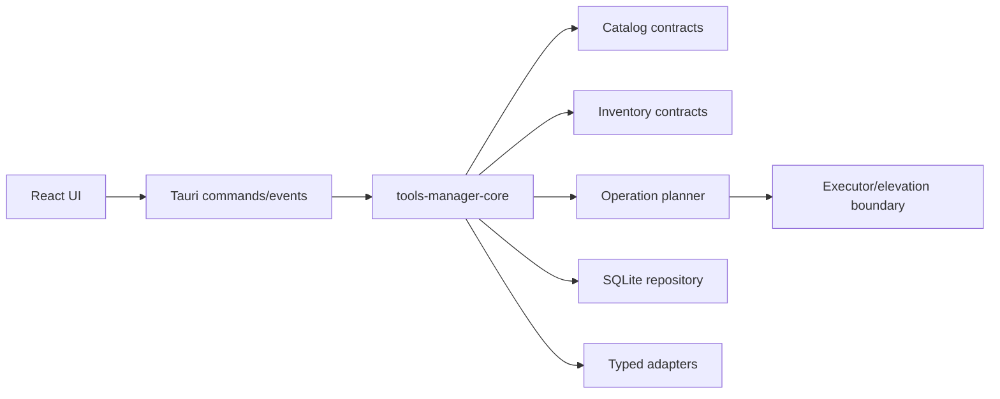

# Phase 1: Foundation Contracts and Feasibility

## Context Links

- [Plan overview](./plan.md)
- [Product authority v0.4.0](../reports/researcher-2026-08-20-tools-manager-market-and-mvp.md)
- [Audit findings](../reports/reviewer-2026-08-20-tools-manager-report-audit.md)
- [Tauri project setup](https://v2.tauri.app/start/create-project/)
- [Tauri command scopes](https://v2.tauri.app/security/scope/)

## Overview

Create the executable repository skeleton and freeze contracts that every adapter and UI action consumes. Prove read-only process supervision, root resolution, persistence, and platform privilege feasibility before implementing the catalog.

## Key Insights

- Repo is greenfield; no code or existing conventions can be reused.
- Canonical recommendation and mapping lifecycle readiness are separate.
- Rust core must remain independent from Tauri so a diagnostic CLI is possible later without becoming an MVP surface.
- Elevation is a platform feasibility question, not an adapter implementation detail.

## Requirements

- [ ] Scaffold Tauri 2 + Vite + React + TypeScript with pnpm and pinned lockfiles.
- [ ] Create a Rust workspace with one reusable `tools-manager-core` library and a thin `src-tauri` host.
- [ ] Record canonical tool, mapping, ownership, inventory, operation, receipt, skill, and client-target contracts.
- [ ] Define application-service commands/events; the webview receives no shell or direct database capability.
- [ ] Prove allowlisted executable + argument-array supervision with timeout, output limit, cancellation, and structured result.
- [ ] Prove canonical global-root resolution without scanning repositories.
- [ ] Spike platform-native per-operation elevation; no password capture and no persistent privileged helper.
- [ ] Select preliminary OS/architecture development matrix and document unsupported combinations.

## Architecture

Dependency direction is one-way: UI → Tauri host → Rust core → platform ports. Catalog data can select an allowlisted adapter/mapping but cannot inject executable paths or arbitrary arguments.

## Related Code Files

- Create: `/Users/itsddvn/projects/tools-managers/package.json`, `/Users/itsddvn/projects/tools-managers/pnpm-lock.yaml`, `/Users/itsddvn/projects/tools-managers/tsconfig.json`, `/Users/itsddvn/projects/tools-managers/vite.config.ts`
- Create: `/Users/itsddvn/projects/tools-managers/Cargo.toml`, `/Users/itsddvn/projects/tools-managers/rust-toolchain.toml`
- Create: `/Users/itsddvn/projects/tools-managers/src/` for React shell and `/Users/itsddvn/projects/tools-managers/src-tauri/` for Tauri host/capabilities
- Create: `/Users/itsddvn/projects/tools-managers/crates/tools-manager-core/src/` with `domain/`, `ports/`, and `application/` modules
- Create: `/Users/itsddvn/projects/tools-managers/catalog/schemas/` and `/Users/itsddvn/projects/tools-managers/tests/fixtures/`
- Create: `/Users/itsddvn/projects/tools-managers/docs/system-architecture.md`, `/Users/itsddvn/projects/tools-managers/docs/code-standards.md`, `/Users/itsddvn/projects/tools-managers/README.md`
- Create: `/Users/itsddvn/projects/tools-managers/.github/workflows/quality.yml`

## Implementation Steps

1. Scaffold React/TypeScript frontend and initialize Tauri 2; pin Node LTS, pnpm, Rust stable, and Tauri major versions.
2. Configure Rust workspace so `src-tauri` depends on `tools-manager-core`; forbid Tauri types inside the core crate.
3. Define serializable domain enums and value objects, including `CatalogStatus`, `MappingStatus`, `ExecutionMode`, `OwnershipKind`, `InventoryState`, and immutable `OperationPlan`.
4. Define port traits for catalog source, inventory adapter, skill client, receipt repository, clock, process supervisor, elevation broker, and application updater.
5. Define narrow Tauri commands for snapshot refresh, list/detail queries, plan generation, consent, execution, cancellation, and diagnostics; use deny-by-default capabilities.
6. Implement feasibility spikes behind test-only/demo ports: safe process spawn, canonical root resolution, SQLite open/migration, Tauri command/event flow, and elevation behavior per host OS.
7. Write ADR-lite decisions in `docs/system-architecture.md`: dependency direction, SQLite ownership, catalog format, execution modes, elevation non-goal, self-update separation.
8. Configure format, lint, typecheck, Rust unit tests, frontend tests, schema validation, and dependency audit commands in CI.
9. Produce a Phase 1 decision record for the initial OS/architecture matrix; unresolved targets remain unsupported, not implicitly supported.

## Todo

- [ ] Tauri dev build opens and completes one typed round-trip command.
- [ ] Rust core compiles and tests without linking the Tauri host.
- [ ] Domain contracts serialize/deserialize through golden fixtures.
- [ ] Process spike proves args remain inert, output is bounded, timeout/cancel work.
- [ ] Root spike rejects project-local and escaping paths.
- [ ] Elevation spike documents Windows, macOS, and Linux strategy/fallback.
- [ ] CI runs frontend and Rust quality gates on at least the primary development OS.

## Success Criteria

- [ ] `pnpm lint`, `pnpm typecheck`, `pnpm test`, `cargo fmt --check`, `cargo clippy --all-targets -- -D warnings`, and `cargo test --workspace` pass.
- [ ] No frontend code can spawn processes, open SQLite, or request privilege directly.
- [ ] Feasibility report identifies supported, detect-only, and blocked platform paths with evidence.
- [ ] Every Phase 2 contract has an owning module and fixture format.

## Risk Assessment

- **Cross-platform elevation is infeasible without helper:** keep mappings read-only; do not broaden privileges to satisfy schedule.
- **Tauri capability leakage:** expose application commands only; deny generic shell/filesystem/database plugins to the webview.
- **Premature abstraction:** keep one core crate with internal modules; split crates only after compile boundaries prove useful.

## Security Considerations

- No shell strings, `sudo` piping, stored administrator credentials, dynamic command names, or catalog-provided arguments.
- All paths are normalized, bounded, and checked against approved roots before reads.
- Test fixtures contain no real home paths, tokens, or machine inventory.

## Next Steps

Proceed to Phase 2 only when domain contracts and feasibility gates are stable. Re-estimate the remaining plan using spike results.
