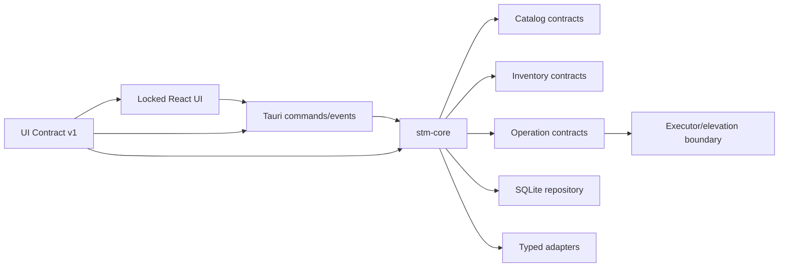

# Phase 2: Foundation Contracts and Feasibility

## Context Links

- [Plan overview](./plan.md)
- [Approved UI contract phase](./phase-01-mobbin-guided-interface-contract.md)
- [Product authority v0.5.0](../reports/researcher-2026-08-20-tools-manager-market-and-mvp.md)
- [Audit findings](../reports/reviewer-2026-08-20-tools-manager-report-audit.md)
- [Tauri project setup](https://v2.tauri.app/start/create-project/)
- [Tauri command scopes](https://v2.tauri.app/security/scope/)

## Overview

Add the Tauri/Rust foundation behind the approved React interface, freeze backend contracts that satisfy UI Contract v1, and prove platform feasibility before the production catalog and core expand. This phase may replace mock IPC at contract-test boundaries but may not redesign locked screens, view states, actions, copy, tokens, interactions, or baselines.

## Key Insights

- UI Contract v1 is the consumer contract. Rust/Tauri code adapts to it; backend convenience does not authorize UI drift.
- Canonical recommendation and mapping lifecycle readiness are separate.
- Rust core remains independent from Tauri so a diagnostic CLI is possible later without becoming an MVP surface.
- Elevation is a platform feasibility question, not an adapter implementation detail.
- Manager, skill-client, and MCP-client feasibility must be proven with fixtures and live smoke evidence before Phase 3 implements every adapter.

## Requirements

- [x] Verify UI Contract v1 lock before work starts and continuously in CI.
- [x] Add Tauri 2 to the existing Vite + React + TypeScript interface with pinned Node, pnpm, Rust, and Tauri versions.
- [x] Create a Rust workspace with one reusable `stm-core` library and a thin `src-tauri` host.
- [x] Record canonical tool, mapping, ownership, inventory, operation, receipt, skill, MCP server, MCP client-binding, auth-reference, application-update, and source-analysis contracts that satisfy the approved UI view states.
- [x] Define application-service commands/events matching the locked typed IPC client; the webview receives no shell or direct database capability.
- [x] Prove allowlisted executable + argument-array supervision with timeout, output limit, cancellation, and structured result.
- [x] Prove read-only inventory feasibility for WinGet, Homebrew, and one representative Linux manager using captured fixtures and live smoke where available.
- [x] Prove configured global-root resolution and read-only candidate scanning for Codex, Claude Code, and AgentKit-compatible skill adapters without scanning repositories.
- [x] Prove read-only MCP server discovery for approved Codex, Claude Code, and Cursor client configuration fixtures, including stdio/HTTP/SSE transport, per-client enablement, auth-reference redaction, duplicate logical bindings, malformed entries, and unsupported schemas.
- [x] Prove SQLite persistence and platform-native per-operation elevation; no password capture and no persistent privileged helper.
- [x] Select the preliminary OS/architecture development matrix and document unsupported combinations.

## Architecture

Dependency direction is one-way: locked UI contract → typed UI client → Tauri host → Rust core → platform ports. Catalog data can select an allowlisted adapter/mapping but cannot inject executable paths or arbitrary arguments.

## Related Code Files

- Modify: `/Users/itsddvn/projects/tools-managers/package.json`, `/Users/itsddvn/projects/tools-managers/pnpm-lock.yaml`, `/Users/itsddvn/projects/tools-managers/tsconfig.json`, `/Users/itsddvn/projects/tools-managers/vite.config.ts`
- Create: `/Users/itsddvn/projects/tools-managers/Cargo.toml`, `/Users/itsddvn/projects/tools-managers/rust-toolchain.toml`
- Create: `/Users/itsddvn/projects/tools-managers/src-tauri/` for the Tauri host and deny-by-default capabilities
- Create: `/Users/itsddvn/projects/tools-managers/crates/stm-core/src/` with `domain/`, `ports/`, and `application/` modules
- Create: `/Users/itsddvn/projects/tools-managers/catalog/schemas/` and `/Users/itsddvn/projects/tools-managers/tests/fixtures/feasibility/`
- Modify: `/Users/itsddvn/projects/tools-managers/contracts/ui/` only through generated backend bindings and compatibility fixtures; locked source artifacts remain unchanged
- Create: `/Users/itsddvn/projects/tools-managers/docs/system-architecture.md`, `/Users/itsddvn/projects/tools-managers/docs/code-standards.md`, `/Users/itsddvn/projects/tools-managers/README.md`
- Create: `/Users/itsddvn/projects/tools-managers/.github/workflows/quality.yml`

## Implementation Steps

1. Verify the approved UI Contract v1 manifest, lockfile, fixture suite, interaction tests, and screenshot baselines before creating backend code.
2. Add Tauri 2 around the existing React interface and configure the Rust workspace so `src-tauri` depends on `stm-core`; forbid Tauri types inside the core crate.
3. Define serializable domain enums and value objects, including `CatalogStatus`, `MappingStatus`, `ExecutionMode`, `OwnershipKind`, `InventoryState`, and immutable `OperationPlan`; map them to the locked UI view-state schemas through explicit application DTOs.
4. Define port traits for catalog source, inventory adapter, skill client, MCP client configuration, source analyzer, receipt repository, clock, process supervisor, elevation broker, and application updater.
5. Define narrow Tauri commands for snapshot refresh, list/detail queries, plan generation, consent, execution, cancellation, and diagnostics; keep signatures compatible with the approved typed UI client and use deny-by-default capabilities.
6. Implement feasibility spikes behind test-only/demo ports: safe process spawn, canonical root resolution, SQLite open/migration, Tauri command/event flow, and elevation behavior per host OS.
7. Spike read-only WinGet, Homebrew, and one representative Linux manager adapter with captured success, empty, malformed, missing-manager, timeout, and version-variant fixtures; run live smoke where the host allows it.
8. Spike Codex, Claude Code, and AgentKit-compatible global skill adapters with configured-root resolution, physical-root deduplication, bounded direct-child discovery, project-root rejection, and symlink-escape tests.
9. Spike approved Codex, Claude Code, and Cursor MCP client configuration adapters using captured fixtures only. Prove read-only parsing, transport normalization, logical-binding deduplication, malformed-entry isolation, and credential-value redaction.
10. Write durable architecture decisions covering dependency direction, UI contract ownership, SQLite ownership, catalog format, execution modes, elevation non-goal, source-analysis trust boundary, MCP credential references, self-update separation, and the UI-contract reopen procedure.
11. Configure format, lint, typecheck, Rust unit tests, frontend contract tests, UI lock verification, schema validation, and dependency audit commands in CI.
12. Produce a Phase 2 decision record for the initial OS/architecture matrix; unresolved targets remain unsupported, not implicitly supported. Re-estimate Phases 3-8 from measured spike results.

## Todo

- [x] UI Contract v1 lock passes before and after every foundation change.
- [x] Tauri development build opens the approved interface and completes one typed round-trip without visual or interaction drift.
- [x] Rust core compiles and tests without linking the Tauri host.
- [x] Domain and application DTO contracts serialize/deserialize through the locked UI fixtures.
- [x] Process spike proves args remain inert, output is bounded, and timeout/cancel work.
- [x] WinGet, Homebrew, and one Linux manager fixture scans produce explicit structured results without elevation.
- [x] Codex, Claude Code, and AgentKit-compatible adapter spikes reject project-local and escaping paths and deduplicate physical roots.
- [x] Codex, Claude Code, and Cursor MCP configuration spikes produce normalized redacted server fixtures without mutation or secret values.
- [x] Elevation spike documents Windows, macOS, and Linux strategy/fallback.
- [x] CI runs frontend, UI-lock, and Rust quality gates on at least the primary development OS.

## Success Criteria

- [x] `pnpm lint`, `pnpm typecheck`, `pnpm test`, UI contract lock verification, `cargo fmt --check`, `cargo clippy --all-targets -- -D warnings`, and `cargo test --workspace` pass.
- [x] The approved UI remains visually and behaviorally equivalent under the Tauri shell.
- [x] Fixture-based WinGet, Homebrew, one Linux manager, three global skill-adapter scans, and three MCP client-configuration scans produce stable canonical states without elevation, project traversal, or credential disclosure.
- [x] No frontend code can spawn processes, open SQLite, request privilege directly, or decide ownership/trust/version policy.
- [x] Feasibility report identifies supported, detect-only, and blocked platform paths with evidence.
- [x] Every Phase 3 contract has an owning module and fixture format compatible with UI Contract v1.

## Risk Assessment

- **Backend contract conflicts with approved UI:** adapt application DTOs or explicitly reopen Phase 1; never silently change locked UI artifacts.
- **Cross-platform elevation is infeasible without helper:** keep mappings read-only; do not broaden privileges to satisfy schedule.
- **Tauri capability leakage:** expose application commands only; deny generic shell/filesystem/database plugins to the webview.
- **Manager/client spike fails:** mark the mapping or client path detect-only/unsupported and revise the affected later phase with evidence.
- **Premature abstraction:** keep one core crate with internal modules; split crates only after compile boundaries prove useful.

## Security Considerations

- No shell strings, `sudo` piping, stored administrator credentials, dynamic command names, or catalog-provided arguments.
- All paths are normalized, bounded, and checked against approved roots before reads.
- Test fixtures contain no real home paths, tokens, or machine inventory.
- The UI lock prevents security-critical warnings, denial states, and consent boundaries from disappearing as backend work proceeds.

## Next Steps

Proceed to Phase 3 only when UI Contract v1 remains locked, domain contracts are stable, and manager/client feasibility gates pass. Reopen Phase 1 before any intentional interface change.