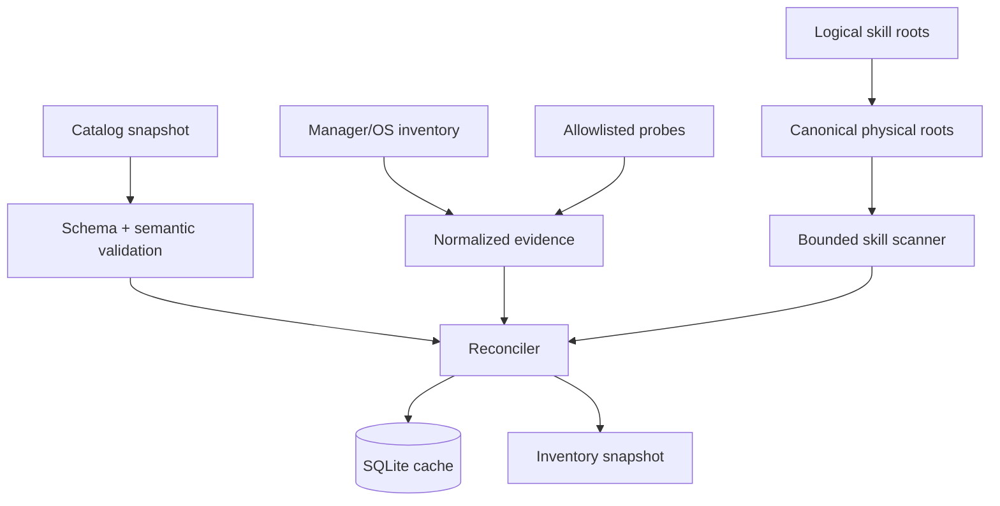

# Phase 2: Read Only Core

## Context Links

- [Plan overview](./plan.md)
- [Foundation contracts](./phase-01-start.md)
- [Product catalog and lifecycle model](../reports/researcher-2026-08-20-tools-manager-market-and-mvp.md#5-canonical-classification-model)

## Overview

Implement a deterministic, fixture-driven Rust core for catalog validation, tool discovery, global skill scanning, ownership reconciliation, SQLite persistence, and update detection. No mutation or elevation path is enabled.

## Key Insights

- The ten Recommended tools are canonically verified, not universally lifecycle-ready.
- Manager inventory is authoritative for ownership; executable probes are discovery evidence only.
- Shared/symlinked skill roots must collapse to one physical scan target while retaining logical clients.

## Requirements

- [ ] Validate tool identity, multi-group membership, recommendation, platform mappings, lifecycle status, execution mode, package references, URLs, license, and detector collision rules.
- [ ] Seed exactly ten Recommended canonical tools and retain all other listed entries as Candidate.
- [ ] Implement read-only WinGet, Homebrew, APT/dpkg, DNF/RPM, and Pacman inventory ports using structured output or bounded parsers.
- [ ] Implement allowlisted executable/version probes for the ten Recommended tools.
- [ ] Reconcile manager, OS metadata, executable, and app receipt evidence into one owner-aware inventory state.
- [ ] Discover only configured global Codex, Claude Code, and AgentKit-compatible roots; validate bounded `SKILL.md` trees without executing content.
- [ ] Persist cache, receipts, operations, scan errors, and catalog snapshot metadata in application-owned SQLite.
- [ ] Resolve update metadata without elevation or mutation; expose freshness and source authority.

## Architecture

Read pipeline:

Catalog activation is all-or-nothing: validate the full bundled snapshot before replacing the active version. A bad refresh leaves the previous snapshot active.

## Related Code Files

- Create: `/Users/itsddvn/projects/tools-managers/catalog/schemas/tool-catalog.schema.json`, `/Users/itsddvn/projects/tools-managers/catalog/schemas/skill-catalog.schema.json`
- Create: `/Users/itsddvn/projects/tools-managers/catalog/tools/recommended.json`, `/Users/itsddvn/projects/tools-managers/catalog/tools/candidates.json`
- Create: `/Users/itsddvn/projects/tools-managers/crates/tools-manager-core/src/catalog/`, `inventory/`, `skills/`, `storage/`, `versioning/`, `adapters/`
- Create: `/Users/itsddvn/projects/tools-managers/crates/tools-manager-core/migrations/`
- Create: `/Users/itsddvn/projects/tools-managers/tests/fixtures/catalog/`, `managers/`, `tools/`, `skills/`, `roots/`
- Modify: `/Users/itsddvn/projects/tools-managers/src-tauri/src/commands/` to expose read-only commands/events
- Modify: `/Users/itsddvn/projects/tools-managers/.github/workflows/quality.yml` for schema and contract suites

## Implementation Steps

1. Implement JSON Schema plus Rust semantic validation; reject duplicate IDs, invalid group/status combinations, overlapping mappings, unknown adapters, and executable/argument content in catalog data.
2. Encode the ten Recommended entries with platform mappings initially marked `detect_only`, `handoff_only`, `unsupported`, or `blocked`; promote nothing to executable in this phase.
3. Implement manager adapters one at a time with captured fixtures and parser contract tests; map failures to structured diagnostics rather than empty inventory.
4. Implement OS application metadata and allowlisted probe adapters with concurrency bounds, timeout, output cap, and explicit parser versions.
5. Implement owner resolution precedence: app receipt → manager inventory → OS/system ownership → external → unknown. Never infer manager ownership from PATH alone.
6. Implement skill-client configuration and root canonicalization. Reject project roots, escaping symlinks, invalid YAML/frontmatter, over-limit files/trees, and duplicate physical writes.
7. Implement canonical skill identity, file manifests, directory digest, logical client bindings, compatibility/risk metadata, and external/managed/modified/conflict states.
8. Implement SQLite migrations and repository ports. Scans write a coherent snapshot transaction; cancellation or parser failure retains the last good snapshot plus diagnostics.
9. Implement update resolvers per authority: owning manager output, authenticated vendor metadata, or pinned Git metadata for trusted catalog entries. Mutable download URLs alone never establish an update.
10. Expose read-only list/detail/refresh/status commands and progress/diagnostic events through the application service.

## Todo

- [ ] Catalog schema and semantic rules cover all v0.4.0 axes.
- [ ] Ten Recommended and Candidate lists validate in CI.
- [ ] Each manager/parser has success, empty, malformed, timeout, missing-manager, and version-variant fixtures.
- [ ] Each Recommended tool has alias/path/version fixtures and collision tests.
- [ ] Skill scanner covers canonical roots, overlap, symlinks, limits, invalid manifests, and duplicate names.
- [ ] SQLite migration, transaction, corruption recovery, and cache freshness tests pass.
- [ ] A headless scan returns a stable inventory snapshot with zero elevation requests.

## Success Criteria

- [ ] All acceptance states in report §2.5 are representable and fixture-tested.
- [ ] Repeated identical scans produce equivalent canonical snapshots and no duplicate skill targets.
- [ ] System-owned Git and unknown/external installs cannot reach mutation planning.
- [ ] Project-local skill fixtures are never traversed.
- [ ] Core test coverage includes every parser, state transition, path boundary, and catalog invariant.

## Risk Assessment

- **Manager output changes:** version fixtures and tolerant parsers fail closed with diagnostics.
- **Slow scan:** bounded concurrency, per-adapter timeout, incremental progress, and last-good cache.
- **False ownership:** require authoritative manager/system evidence; downgrade ambiguity to external/unknown.
- **Root aliasing:** canonicalize paths before scan and before write planning; retain logical binding metadata separately.

## Security Considerations

- Read-only process allowlist is compiled code, not catalog content.
- Catalog refresh activation requires authenticated, versioned metadata; bundled snapshot remains fallback.
- Scanner reads only approved roots, never executes skill files, and rejects traversal/symlink escapes.

## Next Steps

Freeze application-service read models and event contracts before Phase 3 UI work. Mutation remains disabled globally.
