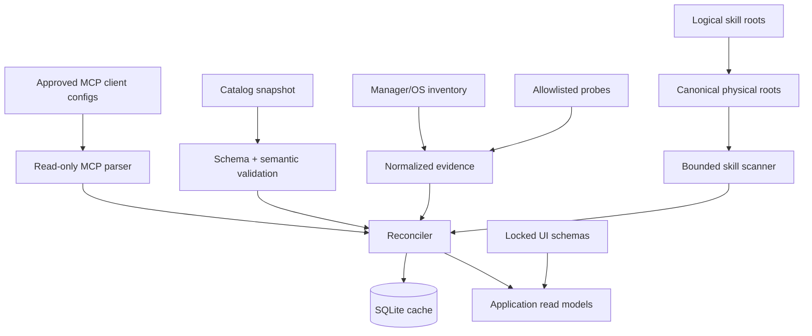

# Phase 3: Read Only Core

## Context Links

- [Plan overview](./plan.md)
- [Approved UI contract phase](./phase-01-mobbin-guided-interface-contract.md)
- [Foundation contracts](./phase-02-foundation-contracts-and-feasibility.md)
- [Product catalog and lifecycle model](../reports/researcher-2026-08-20-tools-manager-market-and-mvp.md#5-canonical-classification-model)

## Overview

Implement a deterministic, fixture-driven Rust core for catalog validation, tool discovery, global skill scanning, MCP server configuration discovery, ownership reconciliation, SQLite persistence, and update detection. The core must produce the locked UI Contract v1 view states without changing the approved interface. No mutation, network source fetch, credential retrieval, or elevation path is enabled.

## Key Insights

- The ten Recommended tools are canonically verified, not universally lifecycle-ready.
- Manager inventory is authoritative for ownership; executable probes are discovery evidence only.
- Shared/symlinked skill roots collapse to one physical scan target while retaining logical clients.
- Consumer-driven UI fixtures are stable contract tests. Backend implementation failures do not justify silently weakening or deleting approved UI states.

## Requirements

- [x] Verify UI Contract v1 lock before work starts and in every CI run.
- [x] Validate tool identity, multi-group membership, recommendation, platform mappings, lifecycle status, execution mode, package references, URLs, license, and detector collision rules.
- [x] Seed exactly ten Recommended canonical tools and retain all other listed entries as Candidate.
- [x] Implement read-only WinGet, Homebrew, APT/dpkg, DNF/RPM, and Pacman inventory ports using structured output or bounded parsers.
- [x] Implement allowlisted executable/version probes for the ten Recommended tools.
- [x] Reconcile manager, OS metadata, executable, and app receipt evidence into one owner-aware inventory state.
- [x] Discover only configured global Codex, Claude Code, and AgentKit-compatible roots; validate bounded `SKILL.md` trees without executing content.
- [x] Discover configured MCP servers only through approved client adapters; normalize transport, command/URL identity, capability hints, logical client bindings, enablement, health evidence, and redacted auth-reference metadata without returning secret values.
- [x] Persist cache, receipts, operations, scan errors, and catalog snapshot metadata in application-owned SQLite.
- [x] Resolve update metadata without elevation or mutation; expose freshness and source authority.
- [x] Serialize application read models and reason codes against the locked UI schemas and fixtures.

## Architecture

Read pipeline:

Catalog activation is all-or-nothing: validate the full bundled snapshot before replacing the active version. A bad refresh leaves the previous snapshot active. Remote catalog refresh remains disabled unless its authentication and version policy are approved.

## Related Code Files

- Create: `/Users/itsddvn/projects/tools-managers/catalog/schemas/tool-catalog.schema.json`, `/Users/itsddvn/projects/tools-managers/catalog/schemas/skill-catalog.schema.json`
- Create: `/Users/itsddvn/projects/tools-managers/catalog/tools/recommended.json`, `/Users/itsddvn/projects/tools-managers/catalog/tools/candidates.json`
- Create: `/Users/itsddvn/projects/tools-managers/crates/tools-manager-core/src/catalog/`, `inventory/`, `skills/`, `mcp/`, `storage/`, `versioning/`, `adapters/`
- Create: `/Users/itsddvn/projects/tools-managers/crates/tools-manager-core/migrations/`
- Create: `/Users/itsddvn/projects/tools-managers/tests/fixtures/catalog/`, `managers/`, `tools/`, `skills/`, `mcp/`, `roots/`
- Modify: `/Users/itsddvn/projects/tools-managers/crates/tools-manager-core/src/application/` to emit locked UI view models and reason codes
- Modify: `/Users/itsddvn/projects/tools-managers/src-tauri/src/commands/` to expose read-only commands/events matching UI Contract v1
- Modify: `/Users/itsddvn/projects/tools-managers/.github/workflows/quality.yml` for schema, contract, and UI-lock suites

## Implementation Steps

1. Verify UI Contract v1 and import its view-state schemas/fixtures as consumer-driven application-service tests; do not edit locked source artifacts from this phase.
2. Implement JSON Schema plus Rust semantic validation; reject duplicate IDs, invalid group/status combinations, overlapping mappings, unknown adapters, and executable/argument content in catalog data.
3. Encode the ten Recommended entries with platform mappings initially marked `detect_only`, `handoff_only`, `unsupported`, or `blocked`; promote nothing to executable in this phase.
4. Implement manager adapters one at a time with captured fixtures and parser contract tests; map failures to the exact approved diagnostic and partial-state view models rather than empty inventory.
5. Implement OS application metadata and allowlisted probe adapters with concurrency bounds, timeout, output cap, and explicit parser versions.
6. Implement owner resolution precedence: app receipt → manager inventory → OS/system ownership → external → unknown. Never infer manager ownership from PATH alone.
7. Implement skill-client configuration and root canonicalization. Reject project roots, escaping symlinks, invalid YAML/frontmatter, over-limit files/trees, and duplicate physical writes.
8. Implement canonical skill identity, file manifests, directory digest, logical client bindings, compatibility/risk metadata, and external/managed/modified/conflict states.
9. Implement read-only Codex, Claude Code, and Cursor MCP configuration adapters. Normalize supported transports and logical bindings, isolate malformed entries, deduplicate canonical server identities, surface unsupported client schemas, and replace credential values with typed references before persistence or UI serialization.
10. Implement SQLite migrations and repository ports. Scans write a coherent snapshot transaction; cancellation or parser failure retains the last good snapshot plus diagnostics.
11. Implement update resolvers per authority: owning manager output, authenticated vendor metadata, or pinned Git metadata for trusted catalog entries. Mutable download URLs alone never establish an update.
12. Expose read-only list/detail/refresh/status application commands and progress/diagnostic events that serialize exactly to UI Contract v1.

## Todo

- [x] UI Contract v1 lock passes before and after every core change.
- [x] Catalog schema and semantic rules cover all v0.5.0 axes.
- [x] Ten Recommended and Candidate lists validate in CI.
- [x] Each manager/parser has success, empty, malformed, timeout, missing-manager, and version-variant fixtures.
- [x] Each Recommended tool has alias/path/version fixtures and collision tests.
- [x] Skill scanner covers canonical roots, overlap, symlinks, limits, invalid manifests, and duplicate names.
- [x] MCP configuration fixtures cover supported transports, multiple client bindings, disabled entries, malformed values, duplicate identities, missing clients, unsupported schema variants, health evidence, and secret redaction.
- [x] SQLite migration, transaction, corruption recovery, and cache freshness tests pass.
- [x] Every approved read-only UI state has a Rust serialization fixture and reason-code contract test.
- [x] A headless scan returns a stable inventory snapshot with zero elevation requests.

## Success Criteria

- [x] All acceptance states in report §2.5 are representable, fixture-tested, and compatible with UI Contract v1.
- [x] Repeated identical scans produce equivalent canonical snapshots and no duplicate skill targets.
- [x] System-owned Git and unknown/external installs cannot reach mutation planning.
- [x] Project-local skill fixtures are never traversed.
- [x] MCP server snapshots never persist or expose credential values and cannot reach configuration planning in the read-only phase.
- [x] Core test coverage includes every parser, state transition, path boundary, catalog invariant, and approved read-model state.
- [x] No locked route, view state, reason code, copy key, or interaction fixture changed to accommodate backend implementation.

## Risk Assessment

- **Backend output does not fit approved UI:** fix the application DTO mapping or reopen Phase 1 with evidence; do not bypass the lock.
- **Manager output changes:** version fixtures and tolerant parsers fail closed with diagnostics.
- **Slow scan:** bounded concurrency, per-adapter timeout, incremental progress, and last-good cache.
- **False ownership:** require authoritative manager/system evidence; downgrade ambiguity to external/unknown.
- **Root aliasing:** canonicalize paths before scan and before write planning; retain logical binding metadata separately.

## Security Considerations

- Read-only process allowlist is compiled code, not catalog content.
- Catalog refresh activation requires authenticated, versioned metadata; bundled snapshot remains fallback.
- Scanner reads only approved roots, never executes skill files, and rejects traversal/symlink escapes.
- Locked UI denial and warning states remain part of the security contract.

## Next Steps

Proceed to Phase 4 only when application read models satisfy every approved UI fixture and mutation remains disabled globally. Reopen Phase 1 before any intentional interface change.