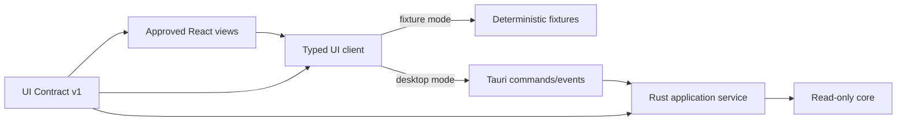

# Phase 4: Desktop Read Only Integration

## Context Links

- [Plan overview](./plan.md)
- [Approved UI contract phase](./phase-01-mobbin-guided-interface-contract.md)
- [Read-only core](./phase-03-read-only-core.md)
- [Desktop UX contract](../reports/researcher-2026-08-20-tools-manager-market-and-mvp.md#10-desktop-ux)
- [Tauri testing](https://v2.tauri.app/develop/tests/)

## Overview

Replace the approved interface's fixture-backed IPC adapter with real Tauri/Rust read-only behavior. Preserve UI Contract v1 exactly: this phase integrates data, progress, cancellation, diagnostics, and retry behavior but does not redesign navigation, view states, copy, tokens, interactions, or responsive layout.

## Key Insights

- The UI already exists and is approved. Integration changes the data source, not the product design.
- Recommendation is curation; platform support and lifecycle confidence remain separate visible axes.
- Error, unsupported, manager-missing, stale, and partial-scan states are primary application-service outputs, not frontend-invented exceptions.
- Visual, interaction, fixture, and screenshot lock checks guard against backend-driven UI drift.

## Requirements

- [x] Verify UI Contract v1 lock before work starts and in every CI run.
- [x] Replace the mock IPC implementation with a real typed Tauri client while retaining the fixture adapter for deterministic UI tests and preview.
- [x] Bind Dashboard, Tools, Skills, MCP Servers, Updates, Operation History, and Settings to Rust application-service commands/events.
- [x] Show the ten Recommended tools with group filters, tool kind, platform mapping, owner, installed/available version, execution mode, and confidence using approved view states.
- [x] Show one canonical skill with all logical client targets and one physical-install representation where roots overlap.
- [x] Show canonical MCP servers with transport, command/URL identity, logical client bindings, capabilities, enablement, trust, health evidence, and redacted auth-reference state using approved view states.
- [x] Support manual refresh, session auto-check, progress, cancellation, freshness, diagnostics, and retry through the approved interactions.
- [x] Keep every update item unselected by default; all mutation controls remain disabled until Phases 5-6 authorize them.
- [x] Preserve keyboard navigation, focus, contrast, reduced-motion, screen-reader labels, and minimum-window behavior from the approved interface.
- [x] Run visual regression against approved screenshots after real IPC integration and packaged Tauri smoke.

## Architecture

React feature modules remain presentation and local interaction only. Rust returns display-ready state enums and reason codes. The integration adapter maps transport concerns without introducing ownership, policy, trust, privilege, or version decisions into the frontend.

## Related Code Files

- Modify: `/Users/itsddvn/projects/tools-managers/src/lib/ipc/` to add the real Tauri adapter while retaining the fixture adapter
- Modify: `/Users/itsddvn/projects/tools-managers/src/features/dashboard/`, `tools/`, `skills/`, `mcp/`, `updates/`, `history/`, `settings/` only for approved data binding and verified defect fixes
- Modify: `/Users/itsddvn/projects/tools-managers/src-tauri/src/commands/` and `/Users/itsddvn/projects/tools-managers/crates/stm-core/src/application/`
- Create: `/Users/itsddvn/projects/tools-managers/e2e-tests/` for packaged read-only smoke and visual integration coverage
- Modify: `/Users/itsddvn/projects/tools-managers/tests/fixtures/ui-contract/` only through the Phase 1 reopen/version-bump process
- Modify: `/Users/itsddvn/projects/tools-managers/package.json`, `/Users/itsddvn/projects/tools-managers/vite.config.ts`, and quality workflows for desktop integration checks

## Implementation Steps

1. Verify UI Contract v1 lock and run the complete fixture-backed UI suite before replacing any data source.
2. Implement the production Tauri IPC adapter behind the same typed UI client interface used by fixtures.
3. Bind approved Dashboard summaries to canonical inventory counts, update availability, manager/client/MCP health, and freshness.
4. Bind approved Tools list/detail/search/filter states to real catalog, mapping, ownership, version, support, recommendation, and alternatives data.
5. Bind approved Skills list/detail states to real source/revision, targets, physical-root deduplication, digest/modification, risk flags, and compatibility data.
6. Bind approved MCP Servers list/detail/search/filter states to normalized client configurations, transports, logical bindings, capabilities, trust, enablement, health, and redacted auth references. Keep add/configure mutation controls disabled.
7. Bind the approved read-only Updates queue to current/target version, source authority, execution mode, disabled reason, and last-checked data; keep selection and mutation disabled.
8. Bind approved Settings and diagnostics interactions to enabled read adapters, approved global roots, MCP client adapters, refresh behavior, bundled catalog channel, and redacted diagnostics; reject project-local root selection in Rust.
9. Connect refresh progress events, cancellation, stale-result rejection, retry, last-good snapshot, and error recovery to their preapproved UI states.
10. Run component, accessibility, IPC contract, renderer integration, visual regression, and desktop smoke checks.
11. Package unsigned development builds on the primary OS to verify real webview, paths, dialogs, process behavior, secret redaction, and zero drift from approved critical screenshots.

## Todo

- [x] UI Contract v1 lock passes before and after integration.
- [x] All seven approved navigation surfaces consume real application-service data without structural redesign.
- [x] Empty, loading, success, partial, stale, unsupported, blocked, manager-unavailable, cancelled, and failure states are reachable through real or deterministic adapter evidence.
- [x] Tool/skill filters remain deterministic and preserve multi-group membership.
- [x] Recommended status is not presented as installability.
- [x] No read-only UI control can create or execute an operation plan.
- [x] Keyboard-only, screen-reader, minimum-window, and visual-regression checks pass critical browse/detail flows.
- [x] Renderer and Tauri smoke suites run in CI for the supported host subset.

## Success Criteria

- [x] User can launch the packaged development app, scan, inspect all ten Recommended tools, inspect global skills and MCP servers, view updates, cancel refresh, and export redacted diagnostics through the approved UI.
- [x] UI correctly explains `detect_only`, `handoff_only`, `unsupported`, `blocked`, manager unavailable, system-owned, external, and unknown states.
- [x] Overlapping client roots display one physical installation with multiple client bindings.
- [x] Frontend contains no package ownership, version comparison, privilege, trust, or mutation decision logic.
- [x] Approved interaction tests and critical screenshot baselines pass with the real IPC adapter.
- [x] Any discovered need to change the interface has reopened Phase 1 rather than bypassed UI Contract v1.

## Risk Assessment

- **Backend cannot represent an approved state:** fix application DTOs or reopen Phase 1 with evidence; do not remove the state from React.
- **Transport details leak into views:** contain Tauri mapping in the typed client adapter.
- **Platform UI differences:** exercise real packaged development builds, not browser tests alone.
- **Visual drift from integration:** treat unexpected screenshot or interaction changes as gate failures.

## Security Considerations

- Tauri capabilities allow only named application commands; no generic shell, filesystem, or SQL access from webview.
- Diagnostics redact home paths, usernames, command output secrets, environment contents, and tokens.
- External links require an allowlisted scheme and explicit opener behavior.
- Approved denial, warning, privilege, and consent copy remains locked even while mutation controls are disabled.

## Next Steps

Proceed to Phase 5 only when the real read-only desktop slice passes UI Contract v1, visual, interaction, accessibility, and packaged smoke gates. Reopen Phase 1 before any intentional interface change.