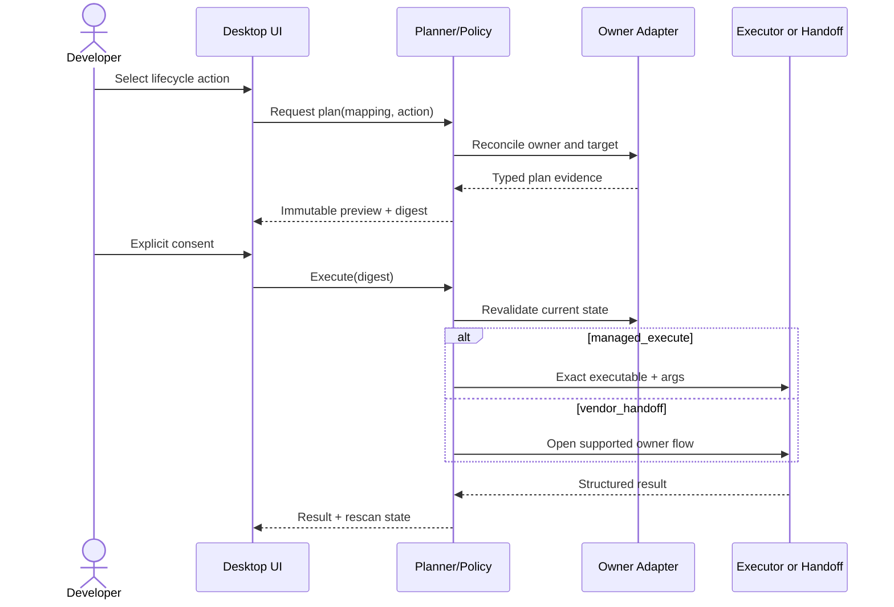

# Phase 4: Safe Tool Lifecycle

## Context Links

- [Plan overview](./plan.md)
- [Read-only core](./phase-02-read-only-core.md)
- [Desktop vertical slice](./phase-03-desktop-read-only-vertical-slice.md)
- [Tool lifecycle contract](../reports/researcher-2026-08-20-tools-manager-market-and-mvp.md#7-tools-manager-lifecycle)

## Overview

Add immutable operation previews and consent, then promote platform mappings individually to `managed_execute` or `vendor_handoff`. Unknown, external, system-owned, detect-only, unsupported, and blocked mappings remain non-mutable.

## Key Insights

- One canonical tool can have several owners and execution modes across machines.
- Vendor handoff is not app-managed execution and cannot claim rollback.
- Package-manager semantics differ; a shared adapter contract must preserve ecosystem-specific comparison, locking, and upgrade rules.

## Requirements

- [ ] Generate immutable plans containing canonical/mapping ID, owner, source, executable + argument array, current/target versions, privilege, affected records/paths, confidence, and limitations.
- [ ] Bind consent to a plan digest and expiry; revalidate owner/current state immediately before execution.
- [ ] Implement `managed_execute` for reviewed WinGet and Homebrew mappings first, then APT/dpkg, DNF/RPM, and Pacman sequentially.
- [ ] Implement `vendor_handoff` as an explicit non-transactional flow with separate result semantics.
- [ ] Request platform-native privilege only for the exact approved operation; scans/checks never elevate.
- [ ] Support cancellation, manager locks, network failure, stale state, privilege denial, structured logs, and deterministic rescan.
- [ ] Promote each Recommended tool mapping only after its own detector/update/plan/no-op/failure/uninstall contract suite passes.

## Architecture

Policy is deny-by-default. Catalog data selects mapping metadata; compiled adapters construct commands. The planner cannot turn detect-only or handoff-only mappings into managed execution.

## Related Code Files

- Create: `/Users/itsddvn/projects/tools-managers/crates/tools-manager-core/src/planning/`, `policy/`, `execution/`, `elevation/`, `operations/`
- Create: `/Users/itsddvn/projects/tools-managers/crates/tools-manager-core/src/adapters/winget/`, `homebrew/`, `apt/`, `dnf/`, `pacman/`, `vendor-handoff/`
- Create: `/Users/itsddvn/projects/tools-managers/tests/fixtures/operations/` and platform lifecycle test harnesses
- Modify: `/Users/itsddvn/projects/tools-managers/catalog/tools/recommended.json` mapping-by-mapping after verification
- Modify: `/Users/itsddvn/projects/tools-managers/src/features/tools/`, `/Users/itsddvn/projects/tools-managers/src/features/updates/`, `/Users/itsddvn/projects/tools-managers/src/features/history/`
- Modify: `/Users/itsddvn/projects/tools-managers/src-tauri/src/commands/` and Tauri capability definitions
- Create: `/Users/itsddvn/projects/tools-managers/.github/workflows/platform-contracts.yml`

## Implementation Steps

1. Implement canonical plan serialization, digest, expiry, consent token, state preconditions, and redacted display model.
2. Implement policy matrix keyed by mapping status, execution mode, owner, requested action, manager availability, privilege, and current state.
3. Implement supervised executor for exact executable/args, working directory, environment allowlist, timeout, output bounds, cancellation, exit mapping, and log redaction.
4. Implement elevation broker ports and platform implementations proven in Phase 1. Reject any operation that needs unsupported privilege behavior.
5. Implement WinGet lifecycle adapter and disposable Windows contract tests: install → rescan → no-op → update check → uninstall.
6. Implement Homebrew formula/cask lifecycle adapter and equivalent macOS contract tests; protect system-owned Git and vendor-owned apps.
7. Implement APT/dpkg, DNF/RPM, and Pacman adapters separately. Preserve distro/package locks and Pacman full-upgrade semantics; no partial-upgrade shortcut.
8. Implement vendor handoff for verified built-in updater/self-update flows. Preview exactly what the app opens/invokes and mark completion as handed off until rescan confirms state.
9. Add UI plan preview, risk/privilege/ownership display, opt-in selection, confirmation, progress, cancellation, result, retry, and recovery guidance.
10. Promote mappings individually in catalog only when platform contract evidence is stored and CI passes. Keep unsupported direct vendor releases detect-only.
11. Add concurrency policy: sequential per manager, bounded across independent managers, explicit manager-lock/backoff handling, complete result reporting.

## Todo

- [ ] Plan digest changes when owner, version, args, privilege, or target changes.
- [ ] Stale or expired consent never executes.
- [ ] Detect-only, handoff-only, external, system-owned, unknown, and unsupported cases have denial tests.
- [ ] WinGet and Homebrew lifecycle suites pass before Linux execution begins.
- [ ] Each Linux adapter passes its own disposable lifecycle and privilege-denial suite.
- [ ] Handoff results never claim transactional rollback or app-owned uninstall.
- [ ] System-owned Git cannot be removed or updated through Homebrew.
- [ ] Bulk results report every selected item even after individual failure.

## Success Criteria

- [ ] At least one reviewed mapping on each approved desktop OS completes safe managed lifecycle, or the OS is explicitly release-blocked/read-only by Phase 1 policy.
- [ ] Repeated install of intended version is no-op.
- [ ] Every action shows exact immutable plan before consent and rejects state drift.
- [ ] No scan, metadata refresh, update check, or handoff preview elevates.
- [ ] No catalog field can introduce an executable or arbitrary argument.
- [ ] Operation history contains redacted plan/result/receipt evidence and recovery guidance.

## Risk Assessment

- **Privilege broker unavailable:** mapping remains detect-only; do not substitute shell `sudo` or password capture.
- **Manager semantics mismatch:** keep separate adapters and contract fixtures; normalize presentation, not ecosystem rules.
- **Vendor updater API changes:** downgrade mapping to detect-only through catalog status update.
- **Partial bulk failure:** isolate items, preserve per-item result, always rescan affected owners.

## Security Considerations

- Revalidate executable identity/owner and state immediately before spawn.
- Use minimum environment and explicit working directory; strip proxy/token variables unless owner requires a reviewed subset.
- Never log credentials, complete home paths, raw environment, or administrator prompts.
- Verify consent digest inside Rust; frontend state is not authorization.

## Next Steps

Keep skill materialization separate. Phase 5 reuses immutable planning and consent concepts but not tool executors or elevation.
