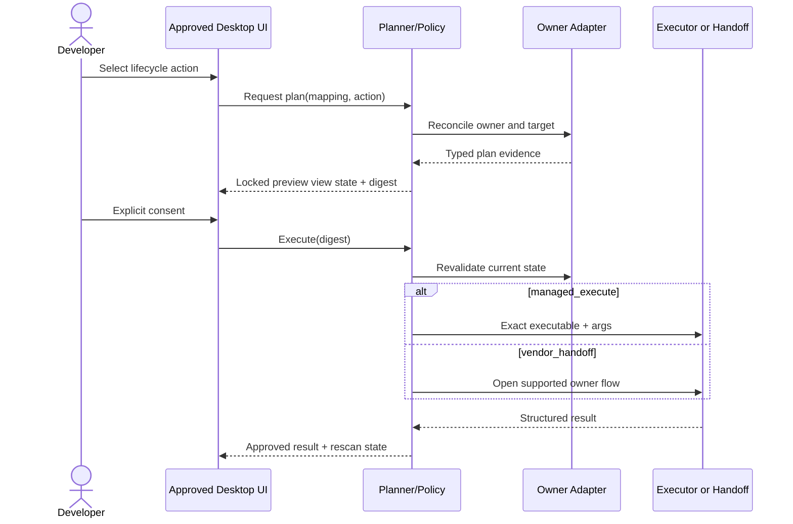

# Phase 5: Safe Tool Lifecycle

## Context Links

- [Plan overview](./plan.md)
- [Approved UI contract phase](./phase-01-mobbin-guided-interface-contract.md)
- [Read-only core](./phase-03-read-only-core.md)
- [Desktop read-only integration](./phase-04-desktop-read-only-integration.md)
- [Tool lifecycle contract](../reports/researcher-2026-08-20-tools-manager-market-and-mvp.md#7-tools-manager-lifecycle)

## Overview

Implement reviewed source-URL analysis plus immutable tool-operation planning and consent, then activate the already approved tool lifecycle UI mapping-by-mapping as platform evidence passes. A pasted URL may identify a supported catalog source or owner handoff, but it never supplies an executable or arbitrary arguments. Unknown, external, system-owned, detect-only, unsupported, and blocked mappings remain non-mutable. `vendor_handoff` uses its approved non-transactional UI and never enters the managed executor.

## Key Insights

- UI Contract v1.1 defines plan preview, opaque trusted plan identity, consent, privilege warning, handoff, progress, cancellation, result, history, retry, and recovery states.
- One canonical tool can have several owners and execution modes across machines.
- Vendor handoff is not app-managed execution and cannot claim rollback.
- Package-manager semantics differ; a shared adapter contract preserves ecosystem-specific comparison, locking, and upgrade rules.

## Requirements

- [x] Verify UI Contract v1.1 lock before work starts and in every CI run.
- [x] Analyze pasted HTTPS tool source URLs through typed allowlisted resolvers. Normalize source identity, match canonical tool/owner/mapping evidence, display limitations and risk, and keep unmatched or unsupported sources inspect-only.
- [x] Generate immutable plans containing canonical/mapping ID, owner, source, executable + argument array, current/target versions, privilege, affected records/paths, confidence, and limitations.
- [x] Bind consent to a plan digest and expiry; revalidate owner/current state immediately before execution.
- [x] Implement `managed_execute` for reviewed WinGet, Homebrew formula/cask, npm, APT/dpkg, and DNF/RPM mappings. Keep Pacman install/update detect-only because its required database refresh invalidates a digest-bound package target; permit package-scoped uninstall only.
- [x] Implement `vendor_handoff` as an explicit non-transactional flow with separate result semantics and the approved handoff interface.
- [x] Request platform-native privilege only for the exact approved operation; scans/checks never elevate.
- [x] Support cancellation, manager locks, network failure, stale state, privilege denial, structured logs, and deterministic rescan through approved states.
- [x] Promote each Recommended tool mapping only after its own detector/update/plan/no-op/failure/uninstall contract suite passes.
- [x] Activate existing UI controls through typed IPC and reason codes; do not redesign the approved plan, consent, progress, result, or recovery flows.

## Architecture

Policy is deny-by-default. Catalog data selects mapping metadata; compiled adapters construct commands. The planner cannot turn detect-only or handoff-only mappings into managed execution. Application DTOs serialize to the locked lifecycle view states.

## Related Code Files

- Core lifecycle: `/Users/itsddvn/projects/tools-managers/crates/stm-core/src/lifecycle/`
- Snapshot and DTO integration: `/Users/itsddvn/projects/tools-managers/crates/stm-core/src/application/service.rs`, `/Users/itsddvn/projects/tools-managers/crates/stm-core/src/application/dto.rs`
- Reviewed mappings: `/Users/itsddvn/projects/tools-managers/catalog/tools/recommended.json`
- Desktop UI bindings: `/Users/itsddvn/projects/tools-managers/src/components/use-lifecycle-operation.ts`, `/Users/itsddvn/projects/tools-managers/src/features/tools/`, `/Users/itsddvn/projects/tools-managers/src/features/updates/`, `/Users/itsddvn/projects/tools-managers/src/features/history/`
- Typed IPC and capabilities: `/Users/itsddvn/projects/tools-managers/src/lib/ipc/`, `/Users/itsddvn/projects/tools-managers/src-tauri/src/commands/`, `/Users/itsddvn/projects/tools-managers/src-tauri/capabilities/`
- Cross-platform contracts: `/Users/itsddvn/projects/tools-managers/.github/workflows/platform-contracts.yml`

## Implementation Steps

1. Verify UI Contract v1.1 and the approved tool source-analysis and lifecycle fixtures, interaction tests, and visual baselines before implementing network or mutation behavior.
2. Implement a bounded HTTPS source-analysis service with normalized URL identity, redirect/size/time limits, reviewed source adapters, canonical tool/owner/mapping matching, typed risk/limitation output, and no execution. Reject embedded credentials and non-HTTPS schemes.
3. Implement canonical plan serialization, digest, expiry, consent token, state preconditions, and redacted display model matching the locked plan-preview contract. Bind analyzed source identity and evidence into the digest.
4. Implement policy matrix keyed by mapping status, execution mode, owner, requested action, manager availability, privilege, source-analysis result, and current state.
5. Implement supervised executor for exact executable/args, working directory, environment allowlist, timeout, output bounds, cancellation, exit mapping, and log redaction.
6. Implement elevation broker ports and platform implementations proven in Phase 2. Reject any operation that needs unsupported privilege behavior.
7. Implement WinGet lifecycle adapter and disposable Windows contract tests: install → rescan → no-op → update check → uninstall.
8. Implement Homebrew formula/cask and npm lifecycle adapters and equivalent macOS contract tests; protect system-owned Git and vendor-owned apps.
9. Implement APT/dpkg and DNF/RPM adapters separately with exact reviewed targets and privilege boundaries. Keep Pacman install/update detect-only; permit only package-scoped uninstall.
10. Implement vendor handoff for verified built-in updater/self-update flows. Preview exactly what the app opens/invokes and mark completion as handed off until rescan confirms state.
11. Bind source analysis, plan, consent, privilege warning, opt-in selection, progress, cancellation, result, retry, history, and recovery application states to the approved UI without structural redesign.
12. Promote mappings individually in catalog only when platform contract evidence is stored and CI passes. Keep unsupported direct vendor releases detect-only.
13. Add concurrency policy: sequential per manager, bounded across independent managers, explicit manager-lock/backoff handling, complete result reporting.

## Todo

- [x] UI Contract v1.1 lock passes before and after lifecycle activation.
- [x] Plan digest changes when owner, version, args, privilege, or target changes.
- [x] Pasted non-HTTPS, credential-bearing, unmatched, ambiguous, unsupported, and oversized/timeout source URLs never reach managed execution planning.
- [x] Stale or expired consent never executes.
- [x] Detect-only, handoff-only, external, system-owned, unknown, and unsupported cases cannot enter the managed executor.
- [x] WinGet, Homebrew formula/cask, and npm disposable lifecycle jobs are required before their promoted mappings merge.
- [x] APT and DNF pass disposable lifecycle plus privilege-boundary suites; Pacman install/update remains detect-only and passes fail-closed policy tests.
- [x] Handoff results never claim transactional rollback or app-owned uninstall.
- [x] System-owned Git cannot be removed or updated through Homebrew.
- [x] Bulk results report every selected item even after individual failure.
- [x] Approved lifecycle interaction and screenshot baselines pass with real operation state fixtures.

## Success Criteria

- [x] At least one reviewed mapping on each approved desktop OS completes safe managed lifecycle, or the OS is explicitly release-blocked/read-only by Phase 2 policy.
- [x] Repeated install of intended version is no-op.
- [x] Every action shows the exact immutable plan in the approved preview before consent and rejects state drift.
- [x] A reviewed supported source URL reaches the same immutable owner-adapter plan as catalog selection; changing the URL or resolved evidence invalidates consent.
- [x] No scan, metadata refresh, update check, or handoff preview elevates.
- [x] No catalog field can introduce an executable or arbitrary argument.
- [x] Operation history contains redacted plan/result/receipt evidence and recovery guidance through approved UI states.
- [x] No locked lifecycle route, state, warning, copy, interaction, or visual baseline changed without reopening Phase 1.

## Verification Results

- **Local contract suites:** the workspace Rust tests, frontend/desktop contracts, production web build, and packaged Tauri release build pass; disposable-platform tests remain isolated to dedicated CI jobs.
- **Runtime proof:** recovery-plan consent review, credential-bearing source rejection/redaction, and packaged desktop single-instance behavior passed. Report: [Phase 5 post-verify](../../.artifacts/report/20260821-083314-phase-five-lifecycle/report.html) (local ignored artifact).
- **Review:** independent correctness and security reviewers report READY with no remaining evidence-backed P1/P2 findings.
- **Platform CI:** [Lifecycle Platform Contracts run 32440872905](https://github.com/itsddvn/stm/actions/runs/32440872905) passed Windows WinGet, macOS Homebrew formula/cask and npm, Ubuntu APT, Fedora DNF, Arch Pacman-uninstall, non-root privilege-denial, and cross-platform core-contract jobs. [Quality run 32440872961](https://github.com/itsddvn/stm/actions/runs/32440872961) and [UI Contract run 32440872906](https://github.com/itsddvn/stm/actions/runs/32440872906) also passed with Node 24-native action runtimes.
- **Outcome:** every Phase 5 requirement, todo, and success criterion is complete; the phase is released to Phase 6 without an interface change.

## Risk Assessment

- **Backend semantics do not fit approved lifecycle UI:** fix DTO/reason-code mapping or reopen Phase 1 with evidence; never bypass the lock.
- **Privilege broker unavailable:** mapping remains detect-only; do not substitute shell `sudo` or password capture.
- **Manager semantics mismatch:** keep separate adapters and contract fixtures; normalize presentation, not ecosystem rules.
- **Vendor updater API changes:** downgrade mapping to detect-only through catalog status update.
- **Partial bulk failure:** isolate items, preserve per-item result, always rescan affected owners.

## Security Considerations

- Revalidate executable identity/owner and state immediately before spawn.
- Use minimum environment and explicit working directory; strip proxy/token variables unless owner requires a reviewed subset.
- Never log credentials, complete home paths, raw environment, or administrator prompts.
- Verify consent digest inside Rust; frontend state is not authorization.
- UI Contract v1.1 locks the exact risk, privilege, ownership, denial, trusted plan identity, and consent information that must remain visible.

## Next Steps

Proceed to Phase 6 only when the immutable planning/consent substrate and approved lifecycle UI binding are stable. Reopen Phase 1 before any intentional interface change.