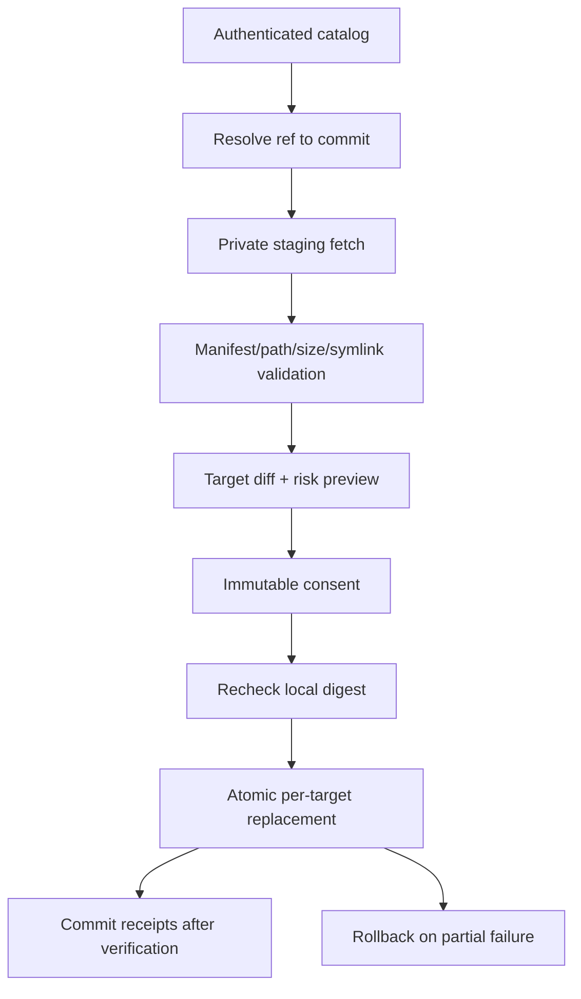

# Phase 5: Trusted Global Skill Lifecycle

## Context Links

- [Plan overview](./plan.md)
- [Read-only core](./phase-02-read-only-core.md)
- [Skills lifecycle contract](../reports/researcher-2026-08-20-tools-manager-market-and-mvp.md#8-skills-manager-lifecycle)
- [Agent Skills specification](https://agentskills.io/specification)
- [Claude Code skills](https://code.claude.com/docs/en/skills)
- [Codex skills](https://developers.openai.com/codex/skills/)

## Overview

Install and update only trusted, catalog-listed global AI Agent Skills using pinned Git provenance, staged validation, immutable preview, receipt-backed atomic replacement, conflict detection, and rollback. This phase does not begin until the catalog trust gate is approved.

## Key Insights

- Skill frontmatter version is optional and not authoritative; resolved Git commit + directory digest own update identity.
- One physical installation may serve several logical clients.
- Skill content is active supply-chain input: inspect and copy, never execute during management.

## Requirements

- [ ] Authenticate and version the selected skill catalog; reject downgrade, invalid signature/authentication, unknown publisher, or malformed snapshot.
- [ ] Resolve repository, subpath, approved ref, immutable commit, expected digest, license, compatibility, and risk metadata.
- [ ] Stage content in an app-private temporary directory; enforce file count/size/path/symlink/type limits and never execute files.
- [ ] Install only into selected approved global client targets; never project-local roots.
- [ ] Record per-target receipt, file manifest, digest, provenance, client binding, and previous managed revision.
- [ ] Detect local modification and block overwrite until developer selects an explicit conflict action.
- [ ] Preview source/revision/risk/file diff and require consent before atomic write.
- [ ] Roll back completed targets when a selected multi-target operation partially fails, or clearly preserve/report split state when rollback also fails.

## Architecture

Physical target identity is canonical path + installation identity. Logical clients bind to it many-to-many; write planning deduplicates physical targets before consent.

## Related Code Files

- Create: `/Users/itsddvn/projects/tools-managers/catalog/skills/` and trusted catalog metadata schema
- Create: `/Users/itsddvn/projects/tools-managers/crates/tools-manager-core/src/skills/catalog/`, `resolver/`, `staging/`, `validation/`, `diff/`, `materialization/`, `rollback/`
- Create: `/Users/itsddvn/projects/tools-managers/tests/fixtures/skill-lifecycle/`
- Modify: `/Users/itsddvn/projects/tools-managers/crates/tools-manager-core/src/storage/` for receipts, previous revisions, and partial results
- Modify: `/Users/itsddvn/projects/tools-managers/src/features/skills/`, `/Users/itsddvn/projects/tools-managers/src/features/updates/`, `/Users/itsddvn/projects/tools-managers/src/features/history/`
- Modify: `/Users/itsddvn/projects/tools-managers/src-tauri/src/commands/` for skill plan/consent/materialization commands

## Implementation Steps

1. Convert the approved publisher/review/authentication decision into catalog trust-root configuration, schema, activation, downgrade prevention, and rotation/revocation procedure.
2. Implement Git source resolver with URL allowlist, subpath containment, ref-to-commit resolution, bounded fetch, immutable commit checkout, and digest verification.
3. Implement staged tree validation: required `SKILL.md`, YAML/frontmatter, canonical identity, file manifest, size/count/depth, symlink escape, binary/script flags, and license/compatibility metadata.
4. Implement target planner that resolves logical clients, canonicalizes physical roots, rejects project locations, deduplicates writes, and detects name/source/path conflicts.
5. Implement receipt-backed install using sibling staging + atomic rename where supported; define platform fallback and cleanup behavior when atomic directory replacement is unavailable.
6. Implement update comparison using trusted resolved commit and digest; frontmatter version remains display-only.
7. Implement local-modification detection and conflict choices: keep local, export diff, restore managed, or side-by-side only where target client supports it.
8. Implement file-level diff/risk preview and immutable consent with target/revision/digest preconditions.
9. Implement multi-target write orchestration, verification, receipt commit, partial failure reporting, rollback, and recovery from interrupted staging.
10. Add UI install/update/conflict/rollback flows and ensure external skills remain inspect-only.
11. Add malicious repository, deleted ref, network loss, target changed after preview, duplicate root, partial write, and rollback-failure tests.

## Todo

- [ ] Trust-gate decision is documented and testable before code accepts remote catalog data.
- [ ] Resolver always records requested ref and immutable resolved commit.
- [ ] Untrusted URL, mutable-only identity, digest mismatch, traversal, and escaping symlink are blocked.
- [ ] External and locally modified skills cannot be overwritten by default.
- [ ] Overlapping Codex/Claude/AgentKit roots produce one physical write.
- [ ] Every selected target has independent result and receipt state.
- [ ] Interrupted/failed update retains a usable previous managed revision or explicit recovery artifact.

## Success Criteria

- [ ] Trusted managed skill installs to one or more global clients after preview and consent.
- [ ] Repeated install of same commit/digest is no-op.
- [ ] Trusted update previews exact revision and file diff; local change blocks overwrite.
- [ ] Project-local roots and unmanaged external skills never reach materialization.
- [ ] No skill script, binary, hook, or instruction executes during scan/install/update/rollback.
- [ ] Partial multi-target failure is visible, recoverable, and never falsely reported as complete.

## Risk Assessment

- **Trust publisher unresolved:** phase remains blocked; read-only external skill inventory still ships.
- **Git/source unavailable:** retain installed content and receipt; show source unavailable.
- **Non-atomic filesystem behavior:** use verified backup/replace sequence and document reduced confidence per platform.
- **Shared physical root:** deduplicate before plan generation to prevent duplicate replacement.

## Security Considerations

- No repository credentials in receipts/logs; use OS credential facilities only if private sources are later approved.
- Fetch into private bounded staging outside managed roots; cleanup is best-effort and verified on next startup.
- Catalog trust never implies skill content is harmless; surface scripts, binaries, symlinks, requirements, and diffs.

## Next Steps

Freeze skill trust roots and recovery behavior before release hardening. Candidate registry integrations remain deferred.
