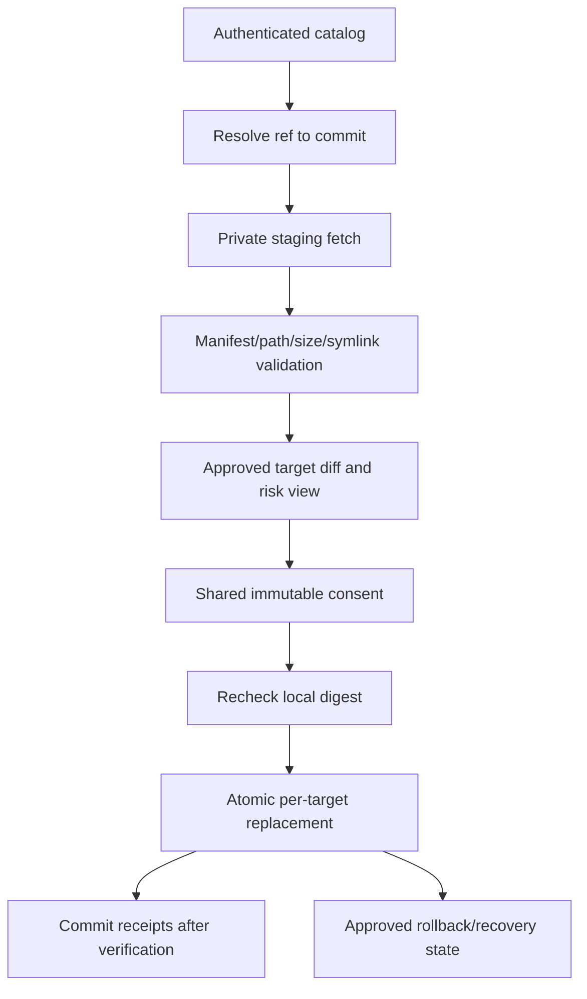

# Phase 6: Trusted Global Skill Lifecycle

## Context Links

- [Plan overview](./plan.md)
- [Approved UI contract phase](./phase-01-mobbin-guided-interface-contract.md)
- [Read-only core](./phase-03-read-only-core.md)
- [Implemented planning and consent substrate](./phase-05-safe-tool-lifecycle.md)
- [Skills lifecycle contract](../reports/researcher-2026-08-20-tools-manager-market-and-mvp.md#8-skills-manager-lifecycle)
- [Agent Skills specification](https://agentskills.io/specification)
- [Claude Code skills](https://code.claude.com/docs/en/skills)
- [Codex skills](https://developers.openai.com/codex/skills/)

## Overview

Analyze pasted HTTPS repository or skill-path URLs, then install and update only sources that resolve to trusted, catalog-listed global AI Agent Skills using pinned Git provenance, staged validation, the implemented immutable planning/consent substrate, receipt-backed atomic replacement, conflict detection, and rollback. Activate the approved source-review/install/update/diff/conflict/progress/result/recovery UI without redesign. This phase does not begin until the catalog trust gate is approved.

## Key Insights

- UI Contract v1.1 defines skill install, update, diff, risk, local-modification conflict, partial failure, rollback, and recovery states.
- Skill frontmatter version is optional and not authoritative; resolved Git commit + directory digest own update identity.
- One physical installation may serve several logical clients.
- Skill content is active supply-chain input: inspect and copy, never execute during management.
- Phase 5 owns the shared immutable plan/digest/expiry/consent substrate; this phase extends it for skill targets and file materialization rather than duplicating authorization logic.

## Requirements

- [ ] Verify UI Contract v1.1 lock and the external trust gate before work starts and in every CI run.
- [ ] Analyze pasted HTTPS skill source URLs before planning; normalize repository/subpath identity, reject embedded credentials and unsupported hosts/schemes, and require a match to authenticated catalog provenance before managed installation.
- [ ] Authenticate and version the selected skill catalog; reject downgrade, invalid signature/authentication, unknown publisher, or malformed snapshot.
- [ ] Resolve repository, subpath, approved ref, immutable commit, expected digest, license, compatibility, and risk metadata.
- [ ] Stage content in an app-private temporary directory; enforce file count/size/path/symlink/type limits and never execute files.
- [ ] Install only into selected approved global client targets; never project-local roots.
- [ ] Record per-target receipt, file manifest, digest, provenance, client binding, and previous managed revision.
- [ ] Detect local modification and block overwrite until the developer selects an approved explicit conflict action.
- [ ] Preview source/revision/risk/file diff through the approved UI and require immutable consent before atomic write.
- [ ] Roll back completed targets when a selected multi-target operation partially fails, or clearly preserve/report split state when rollback also fails.
- [ ] Activate approved skill lifecycle UI controls through typed IPC and reason codes without changing locked routes, states, copy, interactions, or baselines.

## Architecture

Physical target identity is canonical path + installation identity. Logical clients bind to it many-to-many; write planning deduplicates physical targets before consent. Application DTOs extend the Phase 5 operation contract with skill provenance, file diff, and per-target materialization evidence.

## Related Code Files

- Create: `/Users/itsddvn/projects/tools-managers/catalog/skills/` and trusted catalog metadata schema
- Create: `/Users/itsddvn/projects/tools-managers/crates/tools-manager-core/src/skills/catalog/`, `resolver/`, `staging/`, `validation/`, `diff/`, `materialization/`, `rollback/`
- Create: `/Users/itsddvn/projects/tools-managers/tests/fixtures/skill-lifecycle/`
- Modify: `/Users/itsddvn/projects/tools-managers/crates/tools-manager-core/src/planning/` and `policy/` to add skill-specific immutable plan evidence without weakening Phase 5 guarantees
- Modify: `/Users/itsddvn/projects/tools-managers/crates/tools-manager-core/src/storage/` for receipts, previous revisions, and partial results
- Modify: `/Users/itsddvn/projects/tools-managers/src/features/skills/`, `/Users/itsddvn/projects/tools-managers/src/features/updates/`, `/Users/itsddvn/projects/tools-managers/src/features/history/` only to bind approved actions and verified defect fixes
- Modify: `/Users/itsddvn/projects/tools-managers/src-tauri/src/commands/` for skill plan/consent/materialization commands

## Implementation Steps

1. Verify UI Contract v1.1 plus the approved skill source-analysis and lifecycle fixtures, interaction tests, and visual baselines. Confirm the publisher/review/authentication decision is documented and testable.
2. Convert the approved trust decision into catalog trust-root configuration, schema, activation, downgrade prevention, and rotation/revocation procedure.
3. Extend the shared bounded source-analysis service for skill repository/subpath URLs. Produce provenance, requested ref, target-client compatibility, risk, and catalog-match evidence without materialization or execution.
4. Implement Git source resolver with URL allowlist, subpath containment, ref-to-commit resolution, bounded fetch, immutable commit checkout, and digest verification only after the source-review gate passes.
5. Implement staged tree validation: required `SKILL.md`, YAML/frontmatter, canonical identity, file manifest, size/count/depth, symlink escape, binary/script flags, and license/compatibility metadata.
6. Extend the shared operation planner for logical clients, canonical physical roots, project-location rejection, write deduplication, provenance, file diff, and name/source/path conflicts.
7. Implement receipt-backed install using sibling staging + atomic rename where supported; define platform fallback and cleanup behavior when atomic directory replacement is unavailable.
8. Implement update comparison using trusted resolved commit and digest; frontmatter version remains display-only.
9. Implement local-modification detection and approved conflict choices: keep local, export diff, restore managed, or side-by-side only where the target client supports it.
10. Bind file-level diff/risk preview and immutable consent to the approved UI with source/repository/subpath/target/revision/digest preconditions.
11. Implement multi-target write orchestration, verification, receipt commit, partial failure reporting, rollback, and recovery from interrupted staging.
12. Activate approved source-review/install/update/conflict/rollback flows and ensure external skills remain inspect-only; do not structurally redesign the interface.
13. Add malicious repository, deleted ref, network loss, target changed after preview, duplicate root, partial write, and rollback-failure tests.

## Todo

- [ ] UI Contract v1.1 lock and external trust gate pass before and after lifecycle activation.
- [ ] Resolver always records requested ref and immutable resolved commit.
- [ ] Pasted source URLs cannot reach materialization unless normalized provenance matches an authenticated trusted catalog entry.
- [ ] Untrusted URL, mutable-only identity, digest mismatch, traversal, and escaping symlink are blocked.
- [ ] External and locally modified skills cannot be overwritten by default.
- [ ] Overlapping Codex/Claude/AgentKit roots produce one physical write.
- [ ] Every selected target has independent result and receipt state.
- [ ] Interrupted/failed update retains a usable previous managed revision or explicit recovery artifact.
- [ ] Approved skill lifecycle interaction and screenshot baselines pass with real operation state fixtures.

## Success Criteria

- [ ] Trusted managed skill installs to one or more global clients after approved preview and consent.
- [ ] Developer can paste a reviewed trusted skill URL, inspect source/provenance/targets/risk, and reach the same immutable plan as catalog selection; source changes invalidate consent.
- [ ] Repeated install of the same commit/digest is no-op.
- [ ] Trusted update previews exact revision and file diff; local change blocks overwrite.
- [ ] Project-local roots and unmanaged external skills never reach materialization.
- [ ] No skill script, binary, hook, or instruction executes during scan/install/update/rollback.
- [ ] Partial multi-target failure is visible, recoverable, and never falsely reported as complete.
- [ ] Shared immutable consent guarantees from Phase 5 remain intact for skill operations.
- [ ] No locked skill route, state, warning, copy, interaction, or visual baseline changed without reopening Phase 1.

## Risk Assessment

- **Trust publisher unresolved:** phase remains blocked; read-only external skill inventory still ships.
- **Backend semantics do not fit approved skill UI:** fix DTO/reason-code mapping or reopen Phase 1 with evidence; never bypass the lock.
- **Git/source unavailable:** retain installed content and receipt; show source unavailable.
- **Non-atomic filesystem behavior:** use verified backup/replace sequence and document reduced confidence per platform.
- **Shared physical root:** deduplicate before plan generation to prevent duplicate replacement.

## Security Considerations

- No repository credentials in receipts/logs; use OS credential facilities only if private sources are later approved.
- Fetch into private bounded staging outside managed roots; cleanup is best-effort and verified on next startup.
- Catalog trust never implies skill content is harmless; the locked UI must continue surfacing scripts, binaries, symlinks, requirements, and diffs.
- Consent digest verification remains in Rust; frontend state is not authorization.

## Next Steps

Proceed to Phase 7 MCP server lifecycle only after the trust gate, shared consent substrate, approved skill UI binding, and recovery behavior pass. Reopen Phase 1 before any intentional interface change.