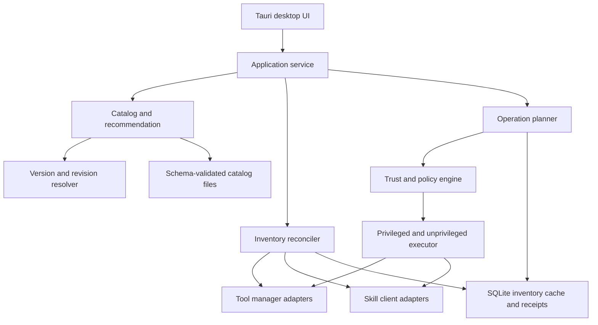

# STM (Smart Tools Management) — Market Scan and MVP Direction

**Version:** 0.5.0<br>
**Date:** 2026-08-20<br>
**Status:** Final<br>
**Source:** Original market scan plus product decisions confirmed on 2026-08-20<br>
**Owner:** Project lead<br>
**License target:** MIT

---

This report defines the product boundary and build direction for STM, an independent, local-first desktop application with three product areas: developer tools, global AI Agent Skills, and MCP servers. It retains the market evidence behind the decision, then turns that evidence into a taxonomy, lifecycle model, architecture, and staged MVP.

**How to read:** product decisions are in §1–2; classification is in §5–6; tool and skill behavior is in §7–8; MCP lifecycle detail is in the implementation plan; implementation detail is in §9–12.

## 1. Executive decision

Build an independent desktop application. Do not fork UniGetUI and do not create a new package ecosystem.

STM is a developer discovery, inventory, ownership, trust, and update-planning layer over existing package managers and supported AI clients. It owns the normalized catalog and user experience; WinGet, Homebrew, APT/dpkg, DNF/RPM, Pacman, and configured MCP clients retain their normal lifecycle and configuration ownership.

The product has three first-class areas:

1. **Tools** — discovers and classifies developer tools, then detects, hands off, or executes lifecycle operations according to the verified platform mapping and authoritative owner.
2. **Skills** — discovers global AI Agent Skills for Codex, Claude Code, and AgentKit-compatible installations, then checks and updates only skills with trusted catalog provenance and an app receipt.
3. **MCP Servers** — inventories configured servers across supported clients, reviews endpoint/configuration changes, and preserves credential references without storing secret values.

The desktop UI is the primary product surface. A reusable Rust core isolates domain logic and adapters so a diagnostic or automation CLI can be added later without coupling lifecycle rules to React.

### 1.1 At a glance

| Decision | Selected direction |
|---|---|
| Product | Independent, dev-first desktop application |
| Platforms | Windows, macOS, and Linux desktop |
| MVP audience | Individual developers |
| UI | Tauri 2 with React/TypeScript |
| Core | Rust domain, inventory, planner, adapters, and executor |
| Tool lifecycle | Per-mapping `managed_execute`, `vendor_handoff`, or `detect_only`; no direct vendor asset installation |
| Skill scope | Global AI Agent Skills only; never scan project-local skills |
| Skill clients | Codex, Claude Code, AgentKit-compatible global directories |
| Skill source | Trusted catalog plus Git receipt |
| Update policy | Detect automatically while app runs; mutate only after explicit consent |
| Background daemon | Out of scope for MVP |
| Public CLI | Deferred; core remains CLI-ready |

## 2. Product contract

### 2.1 Outcome

A local STM desktop application helps developers discover, inspect, install, update, and uninstall development tools; manage global AI Agent Skills; and review configured MCP servers on Windows, macOS, and Linux without memorizing platform-specific commands or manually comparing skill and client configuration directories.

### 2.2 Confirmed product decisions

- Build a new application rather than fork UniGetUI.
- Use a desktop app as the primary UX.
- Target individual developers in the MVP; defer team onboarding workflows.
- Separate Tools, Skills, and MCP Servers in the UI while sharing catalog, inventory, trust, receipt, and update-planning services.
- Allow each tool to belong to one or more functional groups; keep `recommended` as an independent catalog flag.
- Use the user-confirmed initial Recommended set in §6; keep every other listed tool as Candidate.
- Automatically discover installed versions and available updates.
- Never apply an update until the user reviews and confirms its operation plan.
- Manage AI Agent Skills that use a directory containing `SKILL.md`.
- Scan only global skill locations for Codex, Claude Code, and AgentKit-compatible toolkits.
- Do not scan repositories or project-local skill directories.
- Update only catalog-trusted skills whose provenance is recorded in a Git receipt.
- Accept pasted HTTPS tool and skill source URLs only as untrusted review input; resolve them to an approved catalog/owner plan before any installation can be previewed.
- Make MCP Servers a persistent primary navigation surface with inventory, client bindings, transport, capabilities, trust, auth-reference, health, add/configuration review, consent, denial, result, and removal states.
- Store MCP credential references only; raw secrets remain in environment or OS credential facilities.

### 2.3 Constraints

- Application code and the app-owned catalog use MIT licensing.
- Managed third-party tools and skills retain their upstream licenses; MIT does not relicense them.
- Do not build a package ecosystem in the MVP.
- Preserve ownership of packages installed by external package managers.
- Run unprivileged by default; elevate only the exact mutation requiring UAC or root.
- Do not install a persistent privileged helper in the MVP unless a platform feasibility spike proves it necessary and the threat model is revised.
- Never infer and execute commands from README text, pasted text, or arbitrary repository content.
- Do not bundle or mirror third-party binaries in the MVP.
- Model OS and CPU architecture support explicitly.
- Treat a detected asset as unmanaged until an authoritative owner or app receipt is known.
- Never execute scripts bundled with a skill during scan, install, validation, or update.
- Do not follow symlinks outside an approved skill root.
- Never treat a pasted source URL as executable content, proof of ownership, or authorization to mutate tool, skill, or MCP configuration.
- Never persist raw MCP credentials in inventory, receipts, history, diagnostics, logs, or exported data.

### 2.4 Non-goals for MVP

- Arbitrary `curl | sh`, `Invoke-Expression`, source builds, or inferred repository scripts.
- Generic tool installation from any GitHub repository.
- Background auto-update, unattended bulk mutation, or a resident daemon.
- Project-local AI Agent Skill discovery or synchronization.
- Editing or authoring skills inside the application.
- Arbitrary skill registries or one-click installation from untrusted Git URLs.
- Third-party WinGet sources, Homebrew taps, Scoop buckets, or executable adapter plugins.
- Remote fleet management, accounts, cloud sync, or enterprise policy.
- Team profiles, shared bundles, organization catalogs, and onboarding policy enforcement.
- Replacing mise, aqua, Nix, Devbox, or native OS package managers.
- Maintaining two public UX contracts through both desktop and CLI in the MVP.

### 2.5 Acceptance criteria

- Runs on representative Windows, macOS, Debian/Ubuntu, Fedora, and Arch environments.
- Classifies seeded tools as managed, externally installed, missing, update available, unsupported, manager unavailable, or unknown.
- Classifies global skills as managed, external, modified, update available, invalid, conflicting, source unavailable, or unknown.
- Never traverses into project-local skill directories during global scan.
- Deduplicates one canonical skill installed for multiple supported clients while preserving each installation target.
- Repeated tool or skill installation converges to no-op when the intended version and digest already exist.
- Enables tool update/uninstall only when the owning manager is known.
- Enables skill update only when a trusted receipt resolves repository, subpath, ref/commit, and installed digest.
- Detects local skill modification and blocks overwrite until the user chooses a conflict action.
- Scan, search, metadata refresh, and update checks never elevate.
- Every mutation shows source, current and target version/revision, scope, privilege requirement, affected paths, and executable/argument plan before consent.
- Pasted text is never passed to a shell.
- Catalog validation checks unique IDs, group references, recommendation/status consistency, URLs, OS/architecture mappings, package references, licenses, detector collisions, skill sources, subpaths, refs, and digests.
- Lifecycle controls are enabled only when the selected platform mapping, detected owner, lifecycle status, and execution mode authorize the operation.
- Global skill adapters canonicalize and deduplicate physical roots before scanning while preserving every logical client binding.
- Product self-update uses a separate authenticated, signed application-update channel and never reuses tool adapters or tool receipts.
- Source-URL intake rejects non-HTTPS, credential-bearing, or query-parameter URLs; rejected inputs are redacted before fixture state, and accepted sources require deterministic analysis plus fresh consent before a presentation or operation preview.
- MCP inventory preserves per-client bindings and represents transport, capabilities, trust, auth-reference, health, enabled/disabled, unsupported-client, and blocked states without exposing secret values.

## 3. Market boundary

The general package-manager GUI already exists. Devolutions UniGetUI provides a cross-platform desktop GUI for searching, installing, updating, and uninstalling packages through native and ecosystem package managers. Rebuilding that product without a narrower information boundary would duplicate a mature MIT project.

The viable product boundary is the normalized developer catalog, role-based discovery, multi-platform visibility, ownership model, trust metadata, AI Agent Skill lifecycle, MCP configuration inventory, reviewed source intake, and consent-first operation planning.

### 3.1 Closest products

| Product | Strength | Gap versus `tools-manager` |
|---|---|---|
| [Devolutions UniGetUI](https://github.com/Devolutions/UniGetUI) | Cross-platform GUI; broad package-manager lifecycle coverage | Package-centric; no dedicated developer-tool identity model or global AI Agent Skill lifecycle |
| [Zero Install](https://0install.net/) | Decentralized cross-platform installation with GUI/CLI and URL feeds | Requires its feed model; does not unify native-manager ownership or agent skills |
| [mise](https://mise.jdx.dev/dev-tools/) | Cross-platform CLI/version manager with multiple backends | CLI and environment focused; not a desktop host inventory or skill manager |
| [aqua](https://aquaproj.github.io/) | Secure declarative CLI registry with checksums and attestations | CLI-specific; no desktop application lifecycle or global skill inventory |
| [Jetify Devbox](https://www.jetify.com/docs/devbox) | Reproducible project environments backed by Nix | Project/environment focused; not native desktop lifecycle |
| [skills.sh](https://www.skills.sh/docs) | Skill discovery and installation ecosystem | Registry is not an ownership-aware inventory for multiple global client locations; ecosystem safety is not guaranteed |

### 3.2 Why not fork UniGetUI

- The core entity differs: UniGetUI is package-centric; this product is tool- and skill-centric.
- The differentiators require new canonical models, recommendations, trust state, receipts, multi-client skill installations, and conflict handling.
- A long-lived fork pays upstream merge and release costs while carrying managers and UX outside the MVP boundary.
- Security invariants can be designed into the domain and operation planner instead of audited across a generic package engine.
- Native managers remain reusable without inheriting the entire UniGetUI codebase.

UniGetUI remains a benchmark and a possible optional backend integration if its IPC contract proves stable and useful. It is not the product foundation.

## 4. Product surfaces

### 4.1 Tools Manager

- Browse curated developer tools by kind, capability, platform, architecture, and availability.
- Scan native managers and allowlisted read-only probes.
- Normalize installed version, available version, ownership, source, and update state.
- Show exact install/update/uninstall plan before mutation.
- Execute through the owning manager; never silently switch ownership.
- Retain receipts for app-initiated operations and diagnostics.

### 4.2 Skills Manager

- Scan global Codex, Claude Code, and AgentKit-compatible skill roots through client adapters.
- Parse and validate `SKILL.md` plus the bounded directory manifest without executing content.
- Group identical canonical skills across client targets.
- Show compatibility, source, revision, local modification, scripts/assets, and risk flags.
- Install and update only from the trusted catalog using pinned Git provenance.
- Preview file-level diffs and require consent before update.
- Preserve or restore the previous managed revision if an atomic update fails.

### 4.3 Shared services

- Canonical catalog and schema validation.
- Inventory reconciliation and state machine.
- Version/revision resolution.
- Trust policy and risk presentation.
- Operation planning and consent boundary.
- Receipt persistence and rollback metadata.
- Update metadata cache.

## 5. Canonical classification model

A single `category` field is insufficient. `app`, `runtime`, and `package` describe different axes: product shape, functional role, and distribution channel. The catalog SHALL model them separately.

### 5.1 Classification axes

| Axis | Purpose | Examples |
|---|---|---|
| `resource_kind` | Top-level domain | `tool`, `agent_skill` |
| `tool_kind` | What a tool is | `desktop_app`, `cli_tool`, `runtime`, `sdk_toolchain`, `package_manager`, `version_manager`, `service_daemon`, `extension_plugin` |
| `groups` | Functional browse/recommendation groups; one or more per tool | `source_control`, `editors_ides`, `terminal_shell`, `ai_coding_agents`, `databases_data`, `containers_kubernetes` |
| `tags` | Secondary search/filter metadata | `collaboration`, `local_first`, `gpu_accelerated`, `python`, `kubernetes` |
| `recommended` | Independent curated recommendation flag | `true`, `false` |
| `catalog_status` | Canonical identity and metadata verification state | `verified`, `candidate`, `blocked` |
| `distribution_kind` | How a tool is delivered | `winget_package`, `brew_formula`, `brew_cask`, `deb_package`, `rpm_package`, `pacman_package`, `npm_package`, `cargo_crate`, `vendor_installer`, `github_release` |
| `ownership_kind` | Who controls the detected installation | `manager_owned`, `vendor_owned`, `system_owned`, `app_receipt_owned`, `external`, `unknown` |
| `mapping_status` | Verification state for one OS/architecture/distribution/owner path | `ready`, `detect_only`, `handoff_only`, `unsupported`, `blocked` |
| `execution_mode` | What the app may do for the mapping | `managed_execute`, `vendor_handoff`, `detect_only` |
| `lifecycle_capabilities` | What is safely available | `discover`, `detect`, `install`, `check_update`, `update`, `uninstall` |
| `platform_support` | Where a mapping is valid | OS, distribution family, CPU architecture, minimum version |

`package` is therefore not a primary tool kind. A CLI such as Codex may be distributed as an npm package; it remains a `cli_tool` and can belong to the `ai_coding_agents` and `package_version_management` groups.

### 5.2 Tool kinds

| Tool kind | Definition | Detection preference |
|---|---|---|
| `desktop_app` | User-facing graphical application | Owning manager, OS application metadata, allowlisted executable |
| `cli_tool` | Command invoked primarily from a shell | Owning manager, allowlisted executable/version probe |
| `runtime` | Executes programs or workloads | Owning manager, executable probe, runtime metadata |
| `sdk_toolchain` | Compiler, SDK, build toolchain, or grouped development kit | Owning manager, toolchain manager, executable probes |
| `package_manager` | Installs artifacts from an ecosystem or OS catalog | Native/known manager query; bootstrap is separately governed |
| `version_manager` | Installs or selects versions of runtimes/tools | Manager query and owned shims; do not confuse shims with runtime ownership |
| `service_daemon` | Long-running local service used during development | Owning manager plus service metadata; do not start/stop during scan |
| `extension_plugin` | Extends another host application | Host-owned inventory adapter; deferred unless the host is supported |

One canonical tool has one primary `tool_kind` and may belong to several functional groups. Docker Desktop, for example, is a `desktop_app` in both `containers_kubernetes` and `cloud_devops`, with an associated service rather than a second catalog identity unless lifecycle ownership differs by platform.

### 5.3 Functional groups and recommendation

- `source_control`
- `editors_ides`
- `terminal_shell`
- `runtimes_toolchains`
- `package_version_management`
- `containers_kubernetes`
- `databases_data`
- `api_networking`
- `cloud_devops`
- `mobile_development`
- `ai_coding_agents`
- `security_quality`

`groups` is a non-empty set: a tool can appear in several groups without duplicating its canonical identity. Groups drive navigation and recommendation placement but never determine package mappings or install commands.

`recommended` is a Boolean independent from group membership. A recommended tool may appear in every group it belongs to. The flag is allowed only when `catalog_status = verified`; Candidate or Blocked tools remain discoverable but cannot be recommended. Recommendation never grants lifecycle permission: controls are gated by the active mapping, detected owner, `mapping_status`, and `execution_mode`.

Example:

```yaml
id: git
tool_kind: cli_tool
groups: [source_control]
tags: [distributed_vcs]
recommended: true
catalog_status: verified
```

### 5.4 Inventory state model

| State | Meaning | Mutations allowed |
|---|---|---|
| `managed_current` | Owner and installed version/revision known; no update found | Uninstall; reinstall only by explicit repair action |
| `managed_update_available` | Owner known and trusted target available | Update after plan consent |
| `external` | Detected without authoritative owner/receipt | None; show remediation or adoption path |
| `modified` | Managed skill content differs from installed receipt | None until conflict decision |
| `missing` | Supported mapping exists but asset is absent | Install after plan consent |
| `unsupported` | No valid mapping for current OS/architecture/client | None |
| `manager_unavailable` | Mapping exists but required manager is absent | None; show prerequisite |
| `source_unavailable` | Receipt exists but trusted source cannot resolve | None; retain local install |
| `invalid` | Metadata or directory fails validation | None; show validation errors |
| `conflict` | Multiple identities or incompatible installations claim same target | None until resolved |
| `unknown` | Scan or normalization did not establish a safe state | None |

## 6. Initial tool catalog recommendation

Start with the user-confirmed Recommended set. It contains seven priority slots and ten canonical tools because slots 4 and 6 contain multiple tools. Every other listed tool remains Candidate until separately promoted.

`catalog_status = verified` means the canonical identity, trusted upstream, primary kind, groups, and recommendation metadata are verified. Lifecycle readiness is recorded independently for each OS, architecture, distribution, and owner mapping. A Recommended tool can therefore be detect-only, handoff-only, unsupported, or blocked on the current machine.

### 6.1 Recommended tools

| Priority | Canonical ID | Tool | Primary kind | Groups | Initial platform/execution boundary |
|---:|---|---|---|---|---|
| 1 | `git` | Git | `cli_tool` | `source_control` | Package-manager installs may become `managed_execute`; OS-bundled Git is `system_owned` and `detect_only` |
| 2 | `orca-ade` | Orca | `desktop_app` | `source_control`, `editors_ides`, `terminal_shell`, `ai_coding_agents` | Homebrew cask may become `managed_execute`; verified vendor updater is `vendor_handoff` |
| 3 | `cmux-desktop` | cmux desktop | `desktop_app` | `terminal_shell`, `ai_coding_agents` | macOS 14+; Homebrew is `managed_execute`; Sparkle is `vendor_handoff`; distinct from cmux TUI |
| 4 | `docker-desktop` | Docker Desktop | `desktop_app` | `containers_kubernetes`, `cloud_devops` | Reviewed package-manager mappings may execute; Docker Desktop updater is `vendor_handoff` |
| 4 | `orbstack` | OrbStack | `desktop_app` | `containers_kubernetes`, `cloud_devops` | macOS only; vendor lifecycle starts as `vendor_handoff`; alternative to Docker Desktop |
| 5 | `agentkit-cli` | AgentKit CLI (`ak`, from agentkit.best) | `cli_tool` | `ai_coding_agents`, `package_version_management` | Start with macOS detection; package-manager owner may execute, signed `ak self-update` is `vendor_handoff`; AgentKit Desktop App excluded |
| 6 | `oh-my-pi` | Oh My Pi (`omp`) | `cli_tool` | `ai_coding_agents` | Homebrew/Bun/mise owner determines executable mapping; vendor installer remains detect-only until separately reviewed |
| 6 | `codex-cli` | Codex CLI | `cli_tool` | `ai_coding_agents` | npm/Homebrew ownership may execute after review; official installer path is detect-only or handoff-only |
| 6 | `grok-build` | Grok Build (`grok`) | `cli_tool` | `ai_coding_agents` | Official release/update channel starts as `detect_only`; direct asset lifecycle is outside MVP |
| 7 | `cloudflared` | Cloudflare Tunnel (`cloudflared`) | `service_daemon` | `api_networking`, `cloud_devops`, `security_quality` | Native repository, Homebrew, or MSI may execute after review; vendor release is detect-only |

All ten entries use `recommended: true` and `catalog_status: verified`. Recommendation means “curated and relevant,” not “install by default” or “all lifecycle mappings are ready.” Docker Desktop and OrbStack are explicitly competing implementations on macOS, so bundles and UI recommendations SHALL require the user to choose rather than select both automatically.

### 6.2 Candidate tools

All entries below use `recommended: false` and `catalog_status: candidate`.

| Canonical ID | Tool | Primary kind | Groups | Candidate note |
|---|---|---|---|---|
| `github-cli` | GitHub CLI | `cli_tool` | `source_control` | Validate complete package matrix |
| `sourcetree` | SourceTree | `desktop_app` | `source_control` | Platform coverage check |
| `visual-studio-code` | Visual Studio Code | `desktop_app` | `editors_ides` | Validate ownership per installer/channel |
| `cursor` | Cursor | `desktop_app` | `editors_ides`, `ai_coding_agents` | Validate vendor update ownership |
| `zed` | Zed | `desktop_app` | `editors_ides` | Platform coverage check |
| `neovim` | Neovim | `cli_tool` | `editors_ides`, `terminal_shell` | Validate package/version variants |
| `jetbrains-toolbox` | JetBrains Toolbox | `desktop_app` | `editors_ides`, `package_version_management` | Host-managed child tools require separate ownership rules |
| `windows-terminal` | Windows Terminal | `desktop_app` | `terminal_shell` | Windows-only mapping |
| `iterm2` | iTerm2 | `desktop_app` | `terminal_shell` | macOS-only mapping |
| `ghostty` | Ghostty | `desktop_app` | `terminal_shell` | Validate package matrix |
| `warp` | Warp | `desktop_app` | `terminal_shell`, `ai_coding_agents` | Validate vendor update ownership |
| `nodejs` | Node.js | `runtime` | `runtimes_toolchains` | Define major-version and manager coexistence policy |
| `python` | Python | `runtime` | `runtimes_toolchains` | Protect OS-owned Python |
| `go` | Go | `sdk_toolchain` | `runtimes_toolchains` | Validate package matrix |
| `rust-toolchain` | Rust toolchain | `sdk_toolchain` | `runtimes_toolchains` | Distinguish rustup ownership |
| `openjdk` | OpenJDK | `sdk_toolchain` | `runtimes_toolchains` | Vendor and major-version variants required |
| `dotnet-sdk` | .NET SDK | `sdk_toolchain` | `runtimes_toolchains` | Major-version variants required |
| `bun` | Bun | `runtime` | `runtimes_toolchains`, `package_version_management` | Validate self-update versus manager ownership |
| `deno` | Deno | `runtime` | `runtimes_toolchains` | Validate self-update versus manager ownership |
| `mise` | mise | `version_manager` | `runtimes_toolchains`, `package_version_management` | Do not claim child-tool ownership |
| `uv` | uv | `package_manager` | `package_version_management`, `runtimes_toolchains` | Define Python ownership boundary |
| `pipx` | pipx | `package_manager` | `package_version_management` | Keep isolated application ownership |
| `pnpm` | pnpm | `package_manager` | `package_version_management` | Account for Corepack and standalone installs |
| `podman-desktop` | Podman Desktop | `desktop_app` | `containers_kubernetes`, `cloud_devops` | Validate platform package matrix |
| `kubectl` | kubectl | `cli_tool` | `containers_kubernetes`, `cloud_devops` | Kubernetes version-skew rules required |
| `helm` | Helm | `cli_tool` | `containers_kubernetes`, `package_version_management` | Validate package matrix |
| `k9s` | k9s | `cli_tool` | `containers_kubernetes` | Validate package matrix |
| `postgresql` | PostgreSQL | `service_daemon` | `databases_data` | Install must not auto-start without consent |
| `redis` | Redis | `service_daemon` | `databases_data` | Platform mappings differ |
| `dbeaver-community` | DBeaver Community | `desktop_app` | `databases_data` | Validate package matrix |
| `postman` | Postman | `desktop_app` | `api_networking` | Validate vendor update ownership |
| `bruno` | Bruno | `desktop_app` | `api_networking` | Validate package matrix |
| `httpie` | HTTPie | `cli_tool` | `api_networking` | Distinguish CLI and desktop products |
| `terraform` | Terraform | `cli_tool` | `cloud_devops` | License and trust metadata required |
| `opentofu` | OpenTofu | `cli_tool` | `cloud_devops` | Validate package matrix |
| `aws-cli` | AWS CLI | `cli_tool` | `cloud_devops` | Distinguish vendor bundle and package managers |
| `azure-cli` | Azure CLI | `cli_tool` | `cloud_devops` | Validate package matrix |
| `google-cloud-cli` | Google Cloud CLI | `cli_tool` | `cloud_devops` | Component-manager ownership needs policy |
| `claude-code` | Claude Code | `cli_tool` | `ai_coding_agents` | Validate official install/update channels |
| `opencode` | OpenCode | `cli_tool` | `ai_coding_agents` | Validate canonical package matrix |

`skills.sh` remains an external Skills discovery/catalog integration, not an installed tool identity.

### 6.3 Recommended-set implementation order

Implement by reusable lifecycle capability while preserving the user's priority in the UI:

1. **Catalog and detection:** add all ten canonical identities, aliases, platform constraints, trusted upstreams, version parsers, and read-only detectors.
2. **CLI ownership adapters:** Git, AgentKit, Oh My Pi, Codex CLI, Grok Build, and `cloudflared`. Prefer package-manager inventory; use allowlisted `--version` probes only as evidence.
3. **Desktop ownership adapters:** Orca, cmux, Docker Desktop, and OrbStack. Reconcile OS application metadata with Homebrew/vendor receipts and built-in updater ownership.
4. **Update checks:** query the owning manager or authenticated vendor release metadata. Never decide an update from a mutable download URL alone.
5. **Mapping promotion:** assign `detect_only`, `handoff_only`, or `ready` only after the mapping's detector, owner resolution, update check, execution mode, privilege, and failure behavior pass review.
6. **Mutation plans:** enable install/update/uninstall only for `managed_execute` mappings whose detected owner authorizes the exact capability. Handoff-only mappings open the supported owner flow without claiming transactional execution.
7. **Cross-platform fixtures:** promote each OS/architecture mapping independently after its applicable detector, version, update, no-op, handoff, uninstall, and rollback tests pass.

The first vertical slice is read-only inventory and update detection for all ten tools. Mutations follow mapping-by-mapping, beginning with package-manager-owned paths. Vendor/self-updater paths remain handoff-only unless a later product decision expands the threat model.

## 7. Tools Manager lifecycle

### 7.1 Version detection priority

1. Query the owning package manager through structured output where available.
2. Read OS application/package metadata owned by that manager.
3. Run an allowlisted read-only executable with an argument array such as `--version`; enforce timeout and output limits.
4. Use PATH/application presence only to report `external` when ownership remains unknown.
5. Never parse arbitrary README instructions or construct a shell command.

The manager-reported installed version is authoritative for manager-owned lifecycle. Executable output is evidence for discovery, not permission to update or uninstall.

### 7.2 Update detection

- Refresh inventory on application start and on explicit refresh without elevation.
- Ask each available manager for update metadata; normalize version text without forcing all ecosystems into one comparison scheme.
- For vendor-updated applications and self-updating CLIs, use authenticated vendor metadata or the tool's read-only update-check interface; hand off mutation to that owner unless an app receipt explicitly authorizes another path.
- Use the manager's comparison result when its version syntax is ecosystem-specific.
- Cache update metadata for the active session and expose freshness in the UI.
- Do not run a resident scheduler in the MVP.

### 7.3 Mapping execution modes

| Mode | App responsibility | Receipt and rollback claim |
|---|---|---|
| `managed_execute` | Build and execute a typed operation through WinGet, Homebrew, APT/dpkg, DNF/RPM, or Pacman | Record app operation metadata; report only rollback supported by the owning manager |
| `vendor_handoff` | Verify state, show the plan boundary, then open or invoke the owner's supported updater flow | Record the handoff result; do not claim transactional execution or rollback |
| `detect_only` | Report installed and available versions plus safe remediation guidance | No mutation receipt |

Direct vendor asset download, archive extraction, binary replacement, and app-owned uninstall receipts are outside MVP. Ownership is resolved per detected installation; a canonical tool may use different modes on different machines.

### 7.4 Mutation plan

Every install, update, or uninstall plan includes:

- Canonical tool ID and target mapping.
- Owner, source, package ID, scope, current version, and target version.
- Executable path and an argument array; no shell string.
- Expected privilege transition.
- Expected paths or package records where known.
- Rollback/uninstall confidence and limitations.
- Consent token bound to the exact immutable plan.

Before execution, the core revalidates that the selected owner and current state have not changed. A stale plan is rejected and regenerated.

### 7.5 Linux policy

- Detect exactly one active native distribution manager for MVP operations.
- APT automation uses script-appropriate interfaces while dpkg remains inventory authority where required.
- DNF/RPM mappings remain distribution-family scoped.
- Pacman updates respect full-upgrade semantics; do not implement partial-upgrade behavior.
- Flatpak, Snap, Nix, Homebrew-on-Linux, and third-party repositories remain deferred.

## 8. Skills Manager lifecycle

### 8.1 Scope and discovery

Client adapters expose configured global roots. Initial adapters target:

- Codex global skills under its configured home skills directory.
- Claude Code personal skills under `~/.claude/skills/`.
- AgentKit-compatible shared skills under the configured AgentKit/global root.

Paths are resolved through client configuration and environment-aware home resolution; the core does not assume one literal home path. Adapters SHALL reject roots inside a detected project and SHALL NOT recursively search the user's repositories.

Before scanning, adapters resolve approved roots to canonical physical paths and deduplicate roots that target the same directory. The inventory retains all logical client bindings for that physical installation. Canonicalization never relaxes the approved-root or symlink-escape boundary.

Each direct child containing `SKILL.md` is a skill candidate. The scanner reads a bounded manifest of files, parses YAML frontmatter, computes content digests, records symlinks without following escapes, and never executes scripts or dynamic instructions.

### 8.2 Canonical skill identity

For a managed skill, identity is:

```text
catalog-source + repository + repository-subpath + canonical-skill-id
```

Folder name alone is not identity. Two unrelated skills can share a folder/name, and the same canonical skill can be installed into multiple clients.

The UI shows one canonical skill with installation targets such as Codex, Claude Code, and AgentKit. Each target retains its own path, installed digest, compatibility state, and receipt linkage.

### 8.3 Skill purpose taxonomy

- Coding and framework development
- Debugging, testing, and quality
- Code review and security
- Planning, orchestration, and context management
- Documentation and research
- Data, spreadsheets, and office documents
- Design, frontend, and media
- DevOps, deployment, and release
- Business analysis and content
- Browser, application, and service integrations

These are discovery tags, not execution permissions. A skill may have multiple purposes.

### 8.4 Version and revision authority

Agent Skills require `name` and `description`; version is optional metadata. Therefore:

1. **Authoritative update identity:** trusted catalog entry plus repository, subpath, resolved Git commit, and directory digest.
2. **Release label:** trusted tag or release associated with the resolved commit when present.
3. **Display hint:** `metadata.version` or equivalent frontmatter when present and consistent.
4. **Fallback display:** abbreviated commit plus digest when no release label exists.

The application does not infer that a larger frontmatter version is newer, and does not treat mutable branch names as installed revisions. Branches may be catalog tracking inputs, but every install receipt pins the resolved commit and digest.

### 8.5 Skill receipt

A managed skill receipt records:

- Canonical skill ID and catalog source.
- Repository URL, repository subpath, requested ref, resolved commit, and content digest.
- Upstream license and compatibility metadata.
- Installed client targets and absolute target paths.
- Installed file manifest and digest per target.
- Whether scripts, binaries, symlinks, or declared tool requirements exist.
- Install/update timestamp and previous managed revision for rollback.
- Application/catalog version that produced the operation plan.

Receipts contain no credentials or repository access tokens.

### 8.6 Update flow

1. Scan configured global roots and reconcile targets with receipts.
2. Mark receipt-backed content whose digest changed as `modified`.
3. Refresh trusted catalog metadata and resolve the approved upstream ref to a commit.
4. If the resolved commit/digest differs, fetch into a private temporary staging directory.
5. Validate `SKILL.md`, file manifest, size limits, paths, symlinks, and catalog identity.
6. Show source, revision, risk flags, and file-level diff.
7. Require explicit user consent.
8. Recheck local digest to prevent time-of-check/time-of-use overwrite.
9. Write by atomic directory replacement where supported; retain the previous managed bundle until success is verified.
10. Update receipts only after every selected target is complete; otherwise report partial failure and offer rollback.

### 8.7 Conflict behavior

| Situation | Default action |
|---|---|
| External skill with no receipt | Detect and display; never auto-adopt or update |
| Managed skill unchanged locally | Offer trusted update after preview |
| Managed skill modified locally | Block overwrite; offer keep local, export diff, restore managed, or install side-by-side when the client supports it |
| Same canonical skill in several clients | Plan per target; show combined consent and per-target result |
| Same name from different sources | Keep separate canonical identities; show conflict |
| Source missing or ref deleted | Keep installed skill; mark source unavailable |
| Invalid or escaping symlink | Block managed install/update |

The MVP uses copied, receipt-backed target directories rather than cross-client symlinks. This avoids Windows privilege/link differences and makes target-specific validation explicit.

## 9. Architecture

### 9.1 Logical architecture



### 9.2 Components

| Component | Responsibility | Boundary |
|---|---|---|
| Desktop UI | Browse, filter, compare, preview, consent, progress, recovery | No process execution or ownership decisions |
| Application service | Stable commands/events between UI and core | Validates all UI input |
| Catalog service | Canonical identities, mappings, taxonomy, recommendations | Catalog data cannot provide arbitrary executable commands |
| Inventory reconciler | Merge adapter evidence into canonical state | Detection never grants ownership |
| Tool adapters | Query and plan native-manager operations | One typed adapter per manager |
| Skill client adapters | Resolve approved global roots and target capabilities | No project traversal |
| Version resolver | Normalize evidence without erasing ecosystem semantics | Manager/source remains authority |
| Trust/policy engine | Decide whether an operation is allowed and what warnings apply | Deny by default for unknown ownership/provenance |
| Operation planner | Produce immutable preview and consent token | No shell interpolation |
| Executor | Supervise exact executable/args or atomic skill writes | Elevate only scoped tool mutations |
| Elevation broker | Request one platform-native privilege transition for an already-approved immutable plan | No persistent privileged helper or credential storage in MVP |
| Application updater | Verify and apply signed Tools Manager releases | Separate trust root, feed, state, and receipts from managed tools |
| Receipt store | Persist ownership, provenance, digests, and rollback metadata | No credentials or admin passwords |

### 9.3 Storage

- Keep the curated catalog as human-reviewable, schema-validated files in the application repository.
- Compile or bundle a catalog snapshot with the application; optional catalog refresh must be authenticated and versioned before activation.
- Use local SQLite for inventory cache, receipts, scan errors, operation history, and catalog metadata cache.
- Keep staged downloads and rollback bundles in an application-owned data directory with bounded retention.
- Do not store shell history, unrelated PATH contents, repository contents, or project-local skill metadata.

### 9.4 Adapter contract

Every tool adapter exposes typed read methods for availability, inventory, search/mapping validation, and update checks. A mapping exposes only the plan methods authorized by its `mapping_status`, `execution_mode`, lifecycle capabilities, and detected owner. Execution accepts only a previously validated immutable plan; handoff and detect-only mappings cannot enter the managed executor.

Every skill adapter exposes global roots, client identity/version, discovery, compatibility validation, target planning, and atomic materialization capability. It never searches outside configured global roots.

The public core model is independent of Tauri. The same core can later support diagnostic commands such as `scan`, `list`, `doctor`, and `plan` without exposing unattended mutation.

### 9.5 Application self-update

Tools Manager self-update is independent from catalog tool lifecycle. The release channel uses Tauri's signed updater artifacts, an authenticated versioned endpoint, platform-specific packages, explicit consent, and upgrade/rollback smoke tests. Application-update keys, metadata, history, and failures are not stored as tool catalog mappings or tool receipts.

## 10. Desktop UX

### 10.1 Navigation

- **Dashboard** — inventory summary, update counts, errors, unsupported mappings, last scan freshness.
- **Tools** — browse and filter by kind, capability, platform, state, and owner.
- **Skills** — canonical skills with installed targets, revision, local modification, source, and compatibility.
- **Updates** — grouped review queue for tools and skills; every item remains opt-in.
- **Operation history** — plan, result, errors, receipts, and recovery action.
- **Settings** — enabled adapters, global skill roots, update-check behavior, catalog channel, diagnostics.

### 10.2 Required detail views

Tool detail shows publisher, homepage/repository, license/EULA, primary kind, groups, recommendation status, platform matrix, manager/package mapping, installed/available versions, owner, privilege, and lifecycle confidence.

Skill detail shows catalog source, repository/subpath, commit/tag, optional declared version, installed targets, digest state, compatibility, scripts/assets/symlinks, local diff state, and update preview.

### 10.3 Update interaction

- Auto-check means metadata discovery while the app is active, not unattended mutation.
- The Updates page groups available changes but defaults every item to unselected.
- Consent occurs after the exact plan and risk information are visible.
- Tool and skill updates can share one review queue but execute through separate planners/executors.
- Bulk execution remains sequential or concurrency-bounded by adapter policy; one failure does not silently skip reporting for later items.

## 11. Delivery plan

### 11.1 Phase 0 — Mobbin-guided interface prototype and UI contract lock

- Use Mobbin MCP screen and flow searches as reference research; record canonical links and adaptation notes without copying proprietary imagery or branding.
- Build the complete fixture-backed React interface for Dashboard, Tools, Skills, Updates, Operation History, and Settings before backend logic.
- Cover read-only states plus future plan/consent/handoff/progress/result, skill conflict/rollback, diagnostics, and product-update flows.
- Verify the running interface across the approved desktop viewport matrix, accessibility behaviors, and critical screenshots.
- Obtain project-lead approval, then freeze routes, view states, actions, copy, tokens, interactions, fixtures, responsive rules, accessibility behavior, and visual baselines as UI Contract v1.

**Exit:** UI Contract v1 is approved and locked. Every later phase is blocked until the lock passes; intentional UI change requires reopen, re-verification, approval, version bump, and cross-phase propagation.

### 11.2 Phase 1 — Foundation contracts and platform feasibility

- Add Tauri and the reusable Rust core behind the approved interface without visual or interaction drift.
- Spike read-only inventory for WinGet, Homebrew, one Linux manager, and the three global skill adapters.
- Prove Tauri-to-Rust command/event boundary, process supervision, canonical skill-root handling, SQLite persistence, and platform-native per-operation elevation feasibility.
- Define catalog, mapping, receipt, normalized state, execution-mode, application-update, adapter, and application DTO contracts against UI Contract v1.

**Exit:** fixture-based manager and skill-client scans produce stable canonical states without elevation or project traversal; the Tauri development shell preserves UI Contract v1.

### 11.3 Phase 2 — Read-only core

- Implement catalog validation and seed the ten-tool Recommended set with mapping-level platform gates.
- Implement manager inventory, allowlisted detectors, global skill discovery, physical-root deduplication, and canonical reconciliation.
- Implement SQLite cache, receipts, scan diagnostics, state reconciliation, version/revision resolution, and update detection without mutations.
- Build fixture and consumer-contract suites for every approved UI read state before desktop integration.

**Exit:** representative fixtures and live smoke tests classify catalog, mapping, ownership, tool inventory, and global skill states without UI logic or elevation.

### 11.4 Phase 3 — Desktop read-only integration

- Replace the approved interface's fixture IPC adapter with real Tauri commands/events.
- Bind Dashboard, Tools, Skills, Updates, Operation History, and Settings to Rust application-service outputs without redesign.
- Implement refresh, progress, cancellation, diagnostics, retry, and last-good-state integration.
- Keep mutation controls disabled and verify interaction, accessibility, visual baseline, and packaged desktop behavior.

**Exit:** a packaged development build demonstrates end-to-end read-only scan and update visibility through UI Contract v1 with no visual or interaction drift.

### 11.5 Phase 4 — Safe tool lifecycle

- Add immutable operation plans and consent tokens that serialize to the approved lifecycle UI.
- Implement WinGet and Homebrew `managed_execute` mappings first; add APT/dpkg, DNF/RPM, and Pacman sequentially behind the same contract.
- Promote Recommended-tool mappings independently from detect-only to handoff-only or ready after their contract suite passes.
- Implement vendor-updater handoff without claiming app-managed rollback.
- Add platform-native per-operation privilege boundary, process cancellation, structured logs, owner revalidation, and stale-plan rejection.

**Exit:** repeated install is a no-op; update/uninstall require a known owner; no scan elevates; approved lifecycle UI states remain locked.

### 11.6 Phase 5 — Trusted global skill lifecycle

- Reuse the implemented immutable planning/consent substrate for trusted skill operations.
- Implement trusted catalog/Git resolver and staging validation.
- Materialize receipt-backed copies to selected global clients.
- Add digest-based modification detection, diff preview, atomic update, rollback, multi-target results, and approved recovery UI binding.

**Exit:** managed skills update only after consent; external/modified skills are never overwritten; approved skill lifecycle UI states remain locked.

### 11.7 Phase 6 — Cross-platform release hardening

- Cross-platform packaging, signing/notarization, signed Tauri application updates, upgrade testing, and rollback.
- Threat-model review, catalog supply-chain controls, privacy review, and dependency scanning.
- Performance tests for large manager inventories and global skill collections.
- Accessibility, cross-platform visual equivalence, recovery, and failure-message review against UI Contract v1.

**Exit:** signed release candidates pass platform smoke, UI-contract, and security acceptance criteria.

### 11.8 Deferred after MVP

- Deterministic developer bundles beyond basic filtering.
- Analysis-only GitHub/tool URL normalization.
- Local suggestion drafts for missing catalog entries.
- Additional skill catalog discovery integrations beyond the selected trusted publisher.

## 12. Verification strategy

### 12.1 Unit and contract tests

- Catalog schema, duplicate IDs, invalid URLs, mapping collisions, and taxonomy validation.
- Version parsers and manager-output fixtures for each supported platform.
- State-machine transitions and ownership invariants.
- Executable plus argument-array serialization; reject shell strings.
- Skill frontmatter parsing, file manifests, digests, path traversal, symlink escape, size bounds, and duplicate names.
- Receipt reconciliation, local modification detection, stale plan rejection, and rollback state.
- Adapter contract suites reused by every manager/client adapter.

### 12.2 Integration tests

- Container/VM fixtures for Linux managers and disposable test environments for Windows/macOS.
- Install → rescan → no-op install → update check → uninstall lifecycle for safe fixture packages.
- Global skill install into temporary client roots, multi-client deduplication, update, conflict, and rollback.
- Overlapping and symlinked global roots resolve to one physical scan/write target while retaining every logical client binding.
- Cancellation, manager lock contention, network loss, deleted upstream ref, partial multi-target write, and privilege denial.

### 12.3 Security tests

- No scan path requests elevation.
- Detect-only and handoff-only mappings cannot enter the managed executor.
- System-owned installations cannot be mutated through an unrelated package manager.
- Shell metacharacters remain inert arguments.
- Malicious catalog path, archive traversal, escaping symlink, oversized file tree, invalid YAML, and binary/script risk flags.
- Skill contents are never executed during any manager operation.
- Unmanaged tools/skills cannot reach update or uninstall execution paths.
- Consent token cannot authorize a plan whose owner, version, digest, arguments, or targets changed.

### 12.4 Release matrix

- Windows x64 and ARM64 where toolchain support permits.
- macOS Apple Silicon and Intel while upstream UI/runtime support remains available.
- Debian/Ubuntu, Fedora family, and Arch family on representative supported architectures.
- Fresh machine, manager missing, offline, restricted privilege, and corrupted cache scenarios.

## 13. Security and privilege boundaries

- Never use shell interpolation; operation plans contain an executable and argument array.
- Run the desktop app unprivileged.
- Elevate only the exact tool mutation after consent; skill file operations remain user-scoped.
- Use a platform-native per-operation elevation broker; do not assume an interactive `sudo` shell.
- Do not install a persistent privileged helper in MVP.
- Do not collect or store sudo/admin passwords.
- Do not uninstall externally detected tools or update external skills.
- Do not remove user configuration by default.
- Treat skill instructions and scripts as active supply-chain content: inspect and display, never execute during management.
- A trusted catalog is allowlisting and provenance, not a guarantee that upstream content is benign.
- Direct-release tool support, if added later, must pin assets, verify integrity, validate archives, and retain uninstallable receipts.

## 14. Source registry

- [UniGetUI README and platform/package-manager coverage](https://github.com/Devolutions/UniGetUI/blob/main/README.md)
- [UniGetUI releases](https://github.com/Devolutions/UniGetUI/releases)
- [UniGetUI architecture and package-manager interfaces](https://github.com/Devolutions/UniGetUI/blob/main/AGENTS.md)
- [UniGetUI local IPC API](https://github.com/Devolutions/UniGetUI/blob/main/docs/IPC.md)
- [WinGet overview](https://learn.microsoft.com/en-us/windows/package-manager/winget/)
- [Homebrew query interfaces](https://docs.brew.sh/Querying-Brew)
- [APT scripting guidance](https://manpages.debian.org/bookworm/apt/apt.8.en.html)
- [DNF command reference](https://dnf.readthedocs.io/en/stable/command_ref.html)
- [Pacman manual](https://man.archlinux.org/man/pacman.8.en)
- [mise backends](https://mise.jdx.dev/dev-tools/backends/)
- [aqua registry](https://aquaproj.github.io/docs/reference/registry/)
- [GitHub release API](https://docs.github.com/en/rest/releases)
- [GitHub release integrity verification](https://docs.github.com/en/code-security/how-tos/secure-your-supply-chain/secure-your-dependencies/verify-release-integrity)
- [Tauri distribution guide](https://v2.tauri.app/distribute/)
- [Tauri updater and mandatory signed update artifacts](https://v2.tauri.app/plugin/updater/)
- [Agent Skills specification](https://agentskills.io/specification)
- [Claude Code skills and personal skill location](https://code.claude.com/docs/en/skills)
- [OpenAI Codex skills and global skill locations](https://developers.openai.com/codex/skills/)
- [skills.sh documentation and security caveat](https://www.skills.sh/docs)
- [skills.sh catalog API](https://www.skills.sh/docs/api)
- [Git official downloads](https://git-scm.com/downloads)
- [Orca official installation and update documentation](https://www.onorca.dev/docs/install)
- [cmux official installation and update documentation](https://cmux.com/docs/getting-started)
- [Docker Desktop overview and platform support](https://docs.docker.com/desktop/)
- [OrbStack official documentation](https://docs.orbstack.dev/)
- [AgentKit official product](https://agentkit.best/)
- [AgentKit official documentation](https://docs.agentkit.best/)
- [Oh My Pi official repository and installation matrix](https://github.com/can1357/oh-my-pi)
- [Codex CLI official documentation](https://developers.openai.com/codex/cli/)
- [Grok Build official repository](https://github.com/xai-org/grok-build)
- [Cloudflare Tunnel `cloudflared` downloads](https://developers.cloudflare.com/cloudflare-one/networks/connectors/cloudflare-tunnel/downloads/)

## 15. Resolved decisions

| Decision | Resolution | Source |
|---|---|---|
| Independent or UniGetUI fork | Independent application | User decision 2026-08-20 |
| Desktop or CLI | Desktop primary; reusable core; CLI deferred | User decision 2026-08-20 |
| Product areas | Tools, Skills, and MCP Servers | User decisions 2026-08-20 |
| Update behavior | Auto-detect; explicit consent before mutation | User decision 2026-08-20 |
| Skill type | AI Agent Skills with `SKILL.md` | User decision 2026-08-20 |
| Skill scan scope | Global only; no project scan | User decision 2026-08-20 |
| Initial skill clients | Codex, Claude Code, AgentKit-compatible | User decision 2026-08-20 |
| Skill provenance | Trusted catalog plus Git receipt | User decision 2026-08-20 |
| MVP platforms | Windows, macOS, and Linux desktop | User decision 2026-08-20 |
| MVP audience | Individual developers; team onboarding deferred | User decision 2026-08-20 |
| Tool grouping | One or more functional groups per tool; `recommended` is an independent flag | User decision 2026-08-20 |
| Initial Recommended tools | Git; Orca; cmux; Docker Desktop; OrbStack; AgentKit CLI from agentkit.best; Oh My Pi; Codex CLI; Grok Build; Cloudflare Tunnel | User decision 2026-08-20; canonical identities verified against official/local sources |
| Non-recommended catalog entries | Retain as Candidate | User decision 2026-08-20 |
| Recommendation versus readiness | Recommendation is canonical curation; lifecycle readiness is per platform/owner mapping | Review approved by user 2026-08-20 |
| Tool update execution | Per mapping: managed execute, vendor handoff, or detect-only; direct vendor asset lifecycle deferred | Review approved by user 2026-08-20 |
| Application identity | STM, expanded as Smart Tools Management | User decision 2026-08-20 |
| Tool and skill source intake | Paste HTTPS URL; analyze first; require review and fresh consent; never execute repository text | User decision 2026-08-20 |
| MCP management | Persistent primary surface for inventory and reviewed configuration lifecycle | User decision 2026-08-20 |
| MCP credential policy | Store credential references only; never store secret values in STM | User decision 2026-08-20 |

## 16. Unresolved questions

1. Choose the trusted skill catalog publisher/review workflow and authenticated catalog-update mechanism before managed skill lifecycle implementation (implementation plan Phase 6).
2. Resolve supported MCP client configuration schemas, trust policy, and credential-reference mechanism during Phase 2 before MCP lifecycle implementation (implementation plan Phase 7).
3. Define supported OS versions and CPU architectures during foundation feasibility before release packaging (implementation plan Phase 8).

---

## Change Log

| Version | Date | Author | Change |
|---|---|---|---|
| 0.1.0 | 2026-08-20 | Researcher | Initial market scan and MVP direction. |
| 0.2.0 | 2026-08-20 | Codex | Record independent desktop direction; add tool taxonomy, global AI Agent Skills management, consent-first updates, architecture, delivery phases, and verification strategy. |
| 0.2.1 | 2026-08-20 | Codex | Confirm Windows, macOS, and Linux desktop as the MVP platform scope per user decision. |
| 0.2.2 | 2026-08-20 | Codex | Limit the MVP audience to individual developers and defer team onboarding workflows per user decision. |
| 0.2.3 | 2026-08-20 | Codex | Allow multi-group tool membership and model recommendation as an independent ready-only flag per user decision. |
| 0.3.0 | 2026-08-20 | Codex | Define the ten-tool Recommended set, move all other tools to Candidate, verify ambiguous canonical identities, and add owner-aware implementation order. |
| 0.3.1 | 2026-08-20 | Codex | Clarify that the Recommended AgentKit entry is AgentKit CLI (`ak`) from agentkit.best; exclude AgentKit Desktop App as a separate catalog tool. |
| 0.4.0 | 2026-08-20 | Codex | Resolve review findings: split canonical and mapping readiness, define lifecycle execution modes, deduplicate skill roots, bound elevation, separate product self-update, and restructure delivery into vertical slices. |
| 0.4.1 | 2026-08-20 | Codex | Make delivery UI-first: Mobbin reference research, complete fixture-backed interface, project-lead verification, UI Contract v1 lock, and dependent-phase change control before backend logic. |
| 0.5.0 | 2026-08-20 | Codex | Rename the product to STM; add reviewed tool and skill HTTPS source intake; make MCP Servers a persistent primary management area; preserve client ownership and credential-reference boundaries. |
